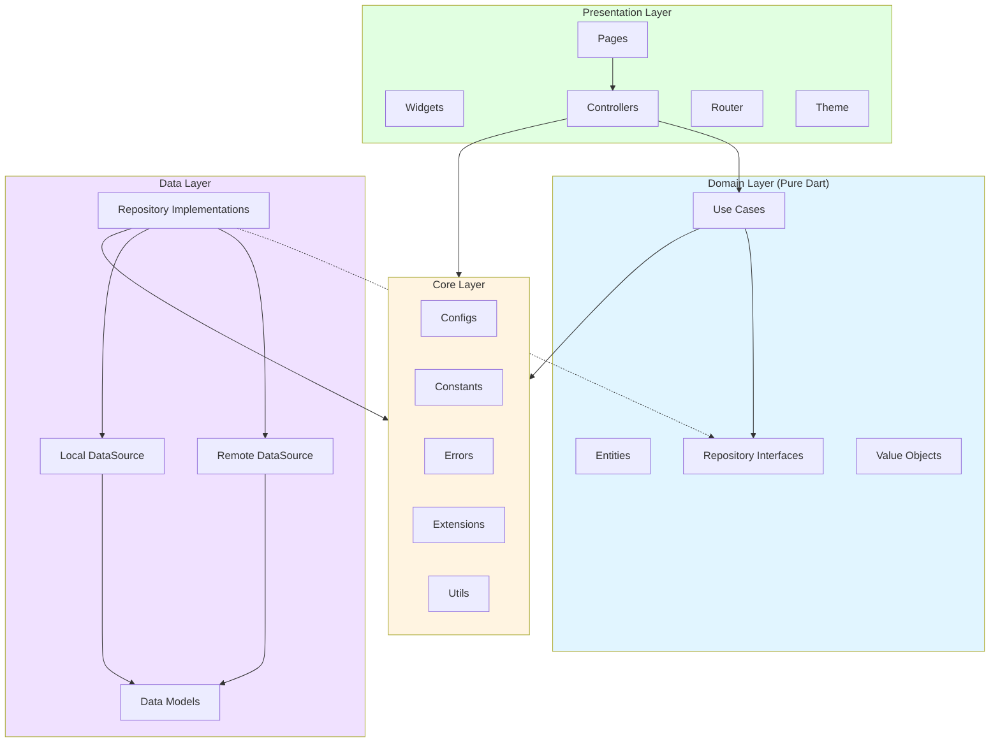
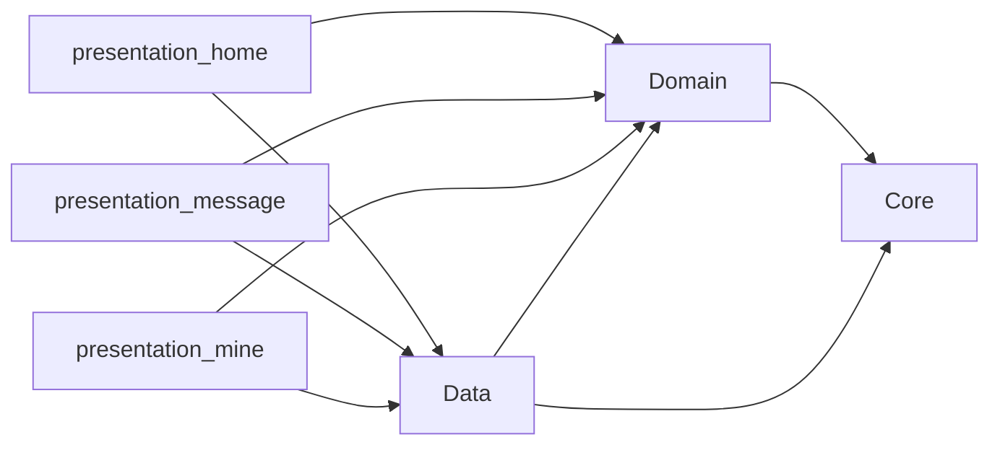
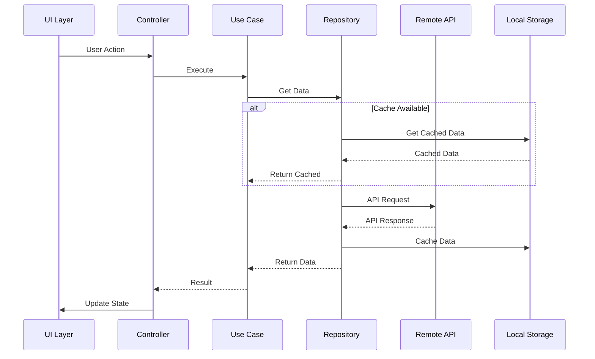
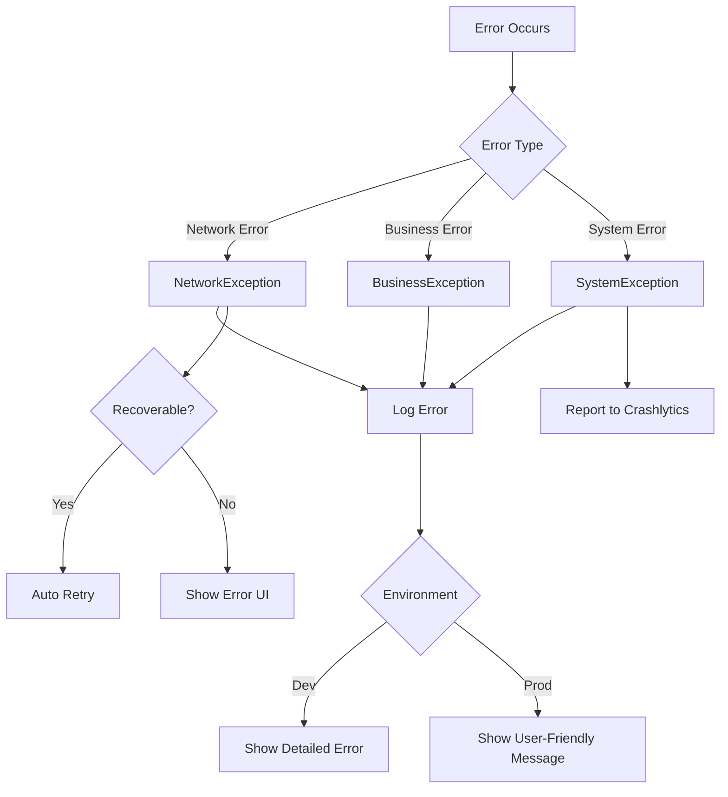

# Design Document: Enterprise Flutter Framework

## Overview

This document describes the detailed design of an enterprise-grade Flutter framework based on Flutter 3.24.0, integrating DDD (Domain-Driven Design) and Clean Architecture principles. The framework is designed to support large-scale commercial applications with millions of users, providing high scalability, robustness, and performance.

### Architecture Philosophy

The framework follows strict **Dependency Inversion Principle**: upper layers depend on lower layer interfaces, not concrete implementations. The architecture consists of four layers from inside out:

1. **Core Layer**: Framework-level capabilities (configs, constants, errors, extensions, utils)
2. **Domain Layer**: Pure business logic (entities, repositories interfaces, use cases, value objects)
3. **Data Layer**: Data source implementations (remote APIs, local storage, repository implementations)
4. **Presentation Layer**: UI components (pages, widgets, controllers, routing, themes)

### Key Design Decisions

- **State Management**: GetX for global/page state + Flutter Hooks for component state + Freezed for immutable data models
- **Networking**: Dio + Retrofit for type-safe API calls with comprehensive interceptor system
- **Storage**: Isar for structured data + SharedPreferences for lightweight configs
- **Routing**: AutoRoute for 100% type-safe navigation with code generation
- **DI**: GetIt for dependency injection and service location
- **Testing**: Dual approach with unit tests + property-based tests for comprehensive coverage

## Architecture

### Layer Diagram



### Module Dependencies




## Components and Interfaces

### Core Layer Components

#### 1. Configuration Management

**AppConfig**
```dart
class AppConfig {
  static const String appName = 'Enterprise Flutter App';
  static const String packageName = 'com.enterprise.flutter';
  static const String version = '1.0.0';
  static const int buildNumber = 1;
  
  // API configurations per environment
  static String get apiBaseUrl => FlavorConfig.instance.apiBaseUrl;
  static Duration get connectTimeout => FlavorConfig.instance.connectTimeout;
  static Duration get receiveTimeout => FlavorConfig.instance.receiveTimeout;
}
```

**FlavorConfig**
```dart
enum Flavor { dev, test, prod }

class FlavorConfig {
  final Flavor flavor;
  final String apiBaseUrl;
  final Duration connectTimeout;
  final Duration receiveTimeout;
  final bool enableDebugLog;
  final String encryptionKey;
  
  static FlavorConfig? _instance;
  static FlavorConfig get instance => _instance!;
  
  factory FlavorConfig({
    required Flavor flavor,
    required String apiBaseUrl,
    Duration connectTimeout = const Duration(seconds: 3),
    Duration receiveTimeout = const Duration(seconds: 10),
    bool enableDebugLog = false,
    required String encryptionKey,
  }) {
    _instance = FlavorConfig._internal(
      flavor: flavor,
      apiBaseUrl: apiBaseUrl,
      connectTimeout: connectTimeout,
      receiveTimeout: receiveTimeout,
      enableDebugLog: enableDebugLog,
      encryptionKey: encryptionKey,
    );
    return _instance!;
  }
  
  FlavorConfig._internal({
    required this.flavor,
    required this.apiBaseUrl,
    required this.connectTimeout,
    required this.receiveTimeout,
    required this.enableDebugLog,
    required this.encryptionKey,
  });
}
```

#### 2. Exception Hierarchy

```dart
/// Base exception class for all custom exceptions
abstract class BaseException implements Exception {
  final String message;
  final int? code;
  final dynamic originalError;
  
  BaseException(this.message, {this.code, this.originalError});
  
  @override
  String toString() => 'BaseException: $message (code: $code)';
}

/// Network-related exceptions
class NetworkException extends BaseException {
  NetworkException(String message, {int? code, dynamic originalError})
      : super(message, code: code, originalError: originalError);
}

class NoInternetConnectionException extends NetworkException {
  NoInternetConnectionException()
      : super('No internet connection', code: -1);
}

class ConnectionTimeoutException extends NetworkException {
  ConnectionTimeoutException()
      : super('Connection timeout', code: -2);
}

class ReceiveTimeoutException extends NetworkException {
  ReceiveTimeoutException()
      : super('Receive timeout', code: -3);
}

/// Business logic exceptions
class BusinessException extends BaseException {
  BusinessException(String message, {int? code})
      : super(message, code: code);
}

/// System-level exceptions
class SystemException extends BaseException {
  SystemException(String message, {dynamic originalError})
      : super(message, originalError: originalError);
}

class JsonSerializableException extends SystemException {
  JsonSerializableException(String message, {dynamic originalError})
      : super(message, originalError: originalError);
}
```


#### 3. Utility Classes

**EncryptionUtil**
```dart
class EncryptionUtil {
  /// AES encryption for sensitive data
  static String encryptAES(String plainText, String key) {
    // Implementation using encrypt package
    final encrypter = Encrypter(AES(Key.fromUtf8(key)));
    final iv = IV.fromLength(16);
    return encrypter.encrypt(plainText, iv: iv).base64;
  }
  
  /// AES decryption
  static String decryptAES(String encrypted, String key) {
    final encrypter = Encrypter(AES(Key.fromUtf8(key)));
    final iv = IV.fromLength(16);
    return encrypter.decrypt64(encrypted, iv: iv);
  }
  
  /// MD5 hash for cache keys
  static String md5Hash(String input) {
    return crypto.md5.convert(utf8.encode(input)).toString();
  }
}
```

**ValidationUtil**
```dart
class ValidationUtil {
  /// Validate phone number (Chinese mobile)
  static bool isValidPhone(String phone) {
    final regex = RegExp(r'^1[3-9]\d{9}$');
    return regex.hasMatch(phone);
  }
  
  /// Validate email
  static bool isValidEmail(String email) {
    final regex = RegExp(r'^[\w-\.]+@([\w-]+\.)+[\w-]{2,4}$');
    return regex.hasMatch(email);
  }
  
  /// Validate ID card (Chinese)
  static bool isValidIdCard(String idCard) {
    final regex = RegExp(r'^\d{17}[\dXx]$');
    return regex.hasMatch(idCard);
  }
}
```

**FormatUtil**
```dart
class FormatUtil {
  /// Format date to string
  static String formatDate(DateTime date, {String pattern = 'yyyy-MM-dd HH:mm:ss'}) {
    return DateFormat(pattern).format(date);
  }
  
  /// Format amount with thousand separator
  static String formatAmount(double amount, {int decimals = 2}) {
    final formatter = NumberFormat('#,##0.${'0' * decimals}');
    return formatter.format(amount);
  }
  
  /// Mask phone number (e.g., 138****1234)
  static String maskPhone(String phone) {
    if (phone.length != 11) return phone;
    return '${phone.substring(0, 3)}****${phone.substring(7)}';
  }
}
```

**LogUtil**
```dart
class LogUtil {
  static final Logger _logger = Logger(
    printer: PrettyPrinter(
      methodCount: 2,
      errorMethodCount: 8,
      lineLength: 120,
      colors: true,
      printEmojis: true,
      printTime: true,
    ),
  );
  
  static void d(String message, [dynamic error, StackTrace? stackTrace]) {
    if (FlavorConfig.instance.enableDebugLog) {
      _logger.d(message, error, stackTrace);
    }
  }
  
  static void i(String message, [dynamic error, StackTrace? stackTrace]) {
    _logger.i(message, error, stackTrace);
  }
  
  static void w(String message, [dynamic error, StackTrace? stackTrace]) {
    _logger.w(message, error, stackTrace);
  }
  
  static void e(String message, [dynamic error, StackTrace? stackTrace]) {
    _logger.e(message, error, stackTrace);
    // Report to Crashlytics in production
    if (FlavorConfig.instance.flavor == Flavor.prod) {
      FirebaseCrashlytics.instance.recordError(error, stackTrace, reason: message);
    }
  }
}
```

### Domain Layer Components

#### 1. Entities

**UserEntity**
```dart
@freezed
class UserEntity with _$UserEntity {
  const factory UserEntity({
    required String id,
    required String nickname,
    required String phone,
    String? avatar,
    String? email,
    @Default(false) bool isVip,
    DateTime? createdAt,
  }) = _UserEntity;
  
  factory UserEntity.fromJson(Map<String, dynamic> json) =>
      _$UserEntityFromJson(json);
}
```

**MessageEntity**
```dart
@freezed
class MessageEntity with _$MessageEntity {
  const factory MessageEntity({
    required String id,
    required String title,
    required String content,
    required MessageType type,
    @Default(false) bool isRead,
    required DateTime createdAt,
  }) = _MessageEntity;
  
  factory MessageEntity.fromJson(Map<String, dynamic> json) =>
      _$MessageEntityFromJson(json);
}

enum MessageType { system, notification, promotion }
```


#### 2. Repository Interfaces

**UserRepository**
```dart
abstract class UserRepository {
  /// Get user information
  Future<Either<BaseException, UserEntity>> getUserInfo(String userId);
  
  /// Update user information
  Future<Either<BaseException, UserEntity>> updateUserInfo(UserEntity user);
  
  /// Logout
  Future<Either<BaseException, void>> logout();
  
  /// Get cached user info from local storage
  Future<UserEntity?> getCachedUserInfo();
  
  /// Cache user info to local storage
  Future<void> cacheUserInfo(UserEntity user);
  
  /// Clear cached user info
  Future<void> clearCachedUserInfo();
}
```

**MessageRepository**
```dart
abstract class MessageRepository {
  /// Get message list with pagination
  Future<Either<BaseException, List<MessageEntity>>> getMessageList({
    required int page,
    required int pageSize,
  });
  
  /// Get unread message count
  Future<Either<BaseException, int>> getUnreadCount();
  
  /// Mark message as read
  Future<Either<BaseException, void>> markAsRead(String messageId);
  
  /// Get message detail
  Future<Either<BaseException, MessageEntity>> getMessageDetail(String messageId);
  
  /// Get cached messages from local storage
  Future<List<MessageEntity>> getCachedMessages();
  
  /// Cache messages to local storage
  Future<void> cacheMessages(List<MessageEntity> messages);
}
```

#### 3. Use Cases

**GetUserInfoUseCase**
```dart
class GetUserInfoUseCase {
  final UserRepository _repository;
  
  GetUserInfoUseCase(this._repository);
  
  Future<Either<BaseException, UserEntity>> call(String userId) async {
    // Try to get from cache first
    final cachedUser = await _repository.getCachedUserInfo();
    if (cachedUser != null) {
      return Right(cachedUser);
    }
    
    // Fetch from remote
    final result = await _repository.getUserInfo(userId);
    
    // Cache if successful
    result.fold(
      (error) => null,
      (user) => _repository.cacheUserInfo(user),
    );
    
    return result;
  }
}
```

**LogoutUseCase**
```dart
class LogoutUseCase {
  final UserRepository _repository;
  
  LogoutUseCase(this._repository);
  
  Future<Either<BaseException, void>> call() async {
    // Call remote logout API
    final result = await _repository.logout();
    
    // Clear local cache regardless of remote result
    await _repository.clearCachedUserInfo();
    
    return result;
  }
}
```

**GetUnreadMessageUseCase**
```dart
class GetUnreadMessageUseCase {
  final MessageRepository _repository;
  
  GetUnreadMessageUseCase(this._repository);
  
  Future<Either<BaseException, int>> call() async {
    return await _repository.getUnreadCount();
  }
}
```

**MarkMessageReadUseCase**
```dart
class MarkMessageReadUseCase {
  final MessageRepository _repository;
  
  MarkMessageReadUseCase(this._repository);
  
  Future<Either<BaseException, void>> call(String messageId) async {
    return await _repository.markAsRead(messageId);
  }
}
```

#### 4. Value Objects

**UserId**
```dart
class UserId {
  final String value;
  
  UserId(this.value) {
    if (value.isEmpty) {
      throw ArgumentError('User ID cannot be empty');
    }
  }
  
  @override
  bool operator ==(Object other) =>
      identical(this, other) ||
      other is UserId && runtimeType == other.runtimeType && value == other.value;
  
  @override
  int get hashCode => value.hashCode;
  
  @override
  String toString() => value;
}
```

**PhoneNumber**
```dart
class PhoneNumber {
  final String value;
  
  PhoneNumber(this.value) {
    if (!ValidationUtil.isValidPhone(value)) {
      throw ArgumentError('Invalid phone number format');
    }
  }
  
  String get masked => FormatUtil.maskPhone(value);
  
  @override
  String toString() => value;
}
```

**Email**
```dart
class Email {
  final String value;
  
  Email(this.value) {
    if (!ValidationUtil.isValidEmail(value)) {
      throw ArgumentError('Invalid email format');
    }
  }
  
  @override
  String toString() => value;
}
```


### Data Layer Components

#### 1. Data Models

**BaseResponse**
```dart
@freezed
class BaseResponse<T> with _$BaseResponse<T> {
  const factory BaseResponse({
    required int code,
    required String message,
    T? data,
  }) = _BaseResponse<T>;
  
  factory BaseResponse.fromJson(
    Map<String, dynamic> json,
    T Function(Object?) fromJsonT,
  ) =>
      _$BaseResponseFromJson(json, fromJsonT);
}
```

**UserResponse**
```dart
@freezed
class UserResponse with _$UserResponse {
  const factory UserResponse({
    required String id,
    required String nickname,
    required String phone,
    String? avatar,
    String? email,
    @Default(false) bool isVip,
    @JsonKey(name: 'created_at') String? createdAt,
  }) = _UserResponse;
  
  factory UserResponse.fromJson(Map<String, dynamic> json) =>
      _$UserResponseFromJson(json);
  
  /// Convert to domain entity
  UserEntity toEntity() {
    return UserEntity(
      id: id,
      nickname: nickname,
      phone: phone,
      avatar: avatar,
      email: email,
      isVip: isVip,
      createdAt: createdAt != null ? DateTime.parse(createdAt!) : null,
    );
  }
}
```

**MessageResponse**
```dart
@freezed
class MessageResponse with _$MessageResponse {
  const factory MessageResponse({
    required String id,
    required String title,
    required String content,
    required String type,
    @JsonKey(name: 'is_read') @Default(false) bool isRead,
    @JsonKey(name: 'created_at') required String createdAt,
  }) = _MessageResponse;
  
  factory MessageResponse.fromJson(Map<String, dynamic> json) =>
      _$MessageResponseFromJson(json);
  
  /// Convert to domain entity
  MessageEntity toEntity() {
    return MessageEntity(
      id: id,
      title: title,
      content: content,
      type: _parseMessageType(type),
      isRead: isRead,
      createdAt: DateTime.parse(createdAt),
    );
  }
  
  static MessageType _parseMessageType(String type) {
    switch (type) {
      case 'system':
        return MessageType.system;
      case 'notification':
        return MessageType.notification;
      case 'promotion':
        return MessageType.promotion;
      default:
        return MessageType.system;
    }
  }
}
```

#### 2. Remote Data Source

**API Client (Dio Configuration)**
```dart
class ApiClient {
  late final Dio _dio;
  
  ApiClient() {
    _dio = Dio(BaseOptions(
      baseUrl: AppConfig.apiBaseUrl,
      connectTimeout: AppConfig.connectTimeout,
      receiveTimeout: AppConfig.receiveTimeout,
      headers: {
        'Content-Type': 'application/json',
        'Accept': 'application/json',
      },
    ));
    
    _dio.interceptors.addAll([
      RequestInterceptor(),
      ResponseInterceptor(),
      DioErrorInterceptor(),
      if (FlavorConfig.instance.enableDebugLog) LogInterceptor(
        requestBody: true,
        responseBody: true,
      ),
    ]);
  }
  
  Dio get dio => _dio;
}
```

**Request Interceptor**
```dart
class RequestInterceptor extends Interceptor {
  @override
  void onRequest(RequestOptions options, RequestInterceptorHandler handler) async {
    // Add common headers
    final token = await _getToken();
    if (token != null) {
      options.headers['Authorization'] = 'Bearer $token';
    }
    
    options.headers['device-id'] = await _getDeviceId();
    options.headers['app-version'] = AppConfig.version;
    options.headers['os-type'] = Platform.isIOS ? 'iOS' : 'Android';
    options.headers['lang'] = Get.locale?.languageCode ?? 'en';
    
    // Encrypt non-GET request parameters
    if (options.method != 'GET' && options.data != null) {
      final encrypted = EncryptionUtil.encryptAES(
        jsonEncode(options.data),
        FlavorConfig.instance.encryptionKey,
      );
      options.data = {'encrypted': encrypted};
    }
    
    LogUtil.d('Request: ${options.method} ${options.uri}');
    handler.next(options);
  }
  
  Future<String?> _getToken() async {
    final sp = await SharedPreferences.getInstance();
    return sp.getString(CacheKeys.TOKEN);
  }
  
  Future<String> _getDeviceId() async {
    final deviceInfo = DeviceInfoPlugin();
    if (Platform.isAndroid) {
      final androidInfo = await deviceInfo.androidInfo;
      return androidInfo.id;
    } else {
      final iosInfo = await deviceInfo.iosInfo;
      return iosInfo.identifierForVendor ?? '';
    }
  }
}
```


**Response Interceptor**
```dart
class ResponseInterceptor extends Interceptor {
  @override
  void onResponse(Response response, ResponseInterceptorHandler handler) {
    final data = response.data;
    
    if (data is Map<String, dynamic>) {
      final code = data['code'] as int?;
      final message = data['message'] as String?;
      
      switch (code) {
        case 200:
          // Success - decrypt if needed
          if (data['data'] is String && data['encrypted'] == true) {
            final decrypted = EncryptionUtil.decryptAES(
              data['data'],
              FlavorConfig.instance.encryptionKey,
            );
            data['data'] = jsonDecode(decrypted);
          }
          handler.next(response);
          break;
          
        case 401:
          // Unauthorized - clear user data and navigate to login
          _handleUnauthorized();
          handler.reject(
            DioException(
              requestOptions: response.requestOptions,
              error: BusinessException('Unauthorized', code: 401),
            ),
          );
          break;
          
        case 403:
          // Forbidden - show dialog and go back
          _handleForbidden(message ?? 'Permission denied');
          handler.reject(
            DioException(
              requestOptions: response.requestOptions,
              error: BusinessException(message ?? 'Forbidden', code: 403),
            ),
          );
          break;
          
        case 404:
          LogUtil.e('API not found: ${response.requestOptions.uri}');
          handler.reject(
            DioException(
              requestOptions: response.requestOptions,
              error: NetworkException('API not found', code: 404),
            ),
          );
          break;
          
        case 500:
        case 502:
        case 503:
        case 504:
          handler.reject(
            DioException(
              requestOptions: response.requestOptions,
              error: NetworkException('Server error', code: code),
            ),
          );
          break;
          
        default:
          handler.reject(
            DioException(
              requestOptions: response.requestOptions,
              error: BusinessException(message ?? 'Unknown error', code: code),
            ),
          );
      }
    } else {
      handler.next(response);
    }
  }
  
  void _handleUnauthorized() async {
    final sp = await SharedPreferences.getInstance();
    await sp.remove(CacheKeys.TOKEN);
    await sp.remove(CacheKeys.USER_INFO);
    Get.offAllNamed(RouteNames.LOGIN);
  }
  
  void _handleForbidden(String message) {
    Get.dialog(
      AlertDialog(
        title: Text('Permission Denied'),
        content: Text(message),
        actions: [
          TextButton(
            onPressed: () {
              Get.back();
              Get.back();
            },
            child: Text('OK'),
          ),
        ],
      ),
    );
  }
}
```

**Error Interceptor**
```dart
class DioErrorInterceptor extends Interceptor {
  @override
  void onError(DioException err, ErrorInterceptorHandler handler) {
    BaseException exception;
    
    switch (err.type) {
      case DioExceptionType.connectionTimeout:
        exception = ConnectionTimeoutException();
        break;
      case DioExceptionType.receiveTimeout:
        exception = ReceiveTimeoutException();
        break;
      case DioExceptionType.connectionError:
        exception = NoInternetConnectionException();
        break;
      case DioExceptionType.badResponse:
        if (err.error is BaseException) {
          exception = err.error as BaseException;
        } else {
          exception = NetworkException('Bad response', code: err.response?.statusCode);
        }
        break;
      default:
        exception = SystemException(err.message ?? 'Unknown error', originalError: err);
    }
    
    LogUtil.e('Network error', exception);
    handler.reject(DioException(
      requestOptions: err.requestOptions,
      error: exception,
    ));
  }
}
```

**API Services (Retrofit)**
```dart
@RestApi()
abstract class UserApiService {
  factory UserApiService(Dio dio) = _UserApiService;
  
  @GET('/user/{id}')
  Future<BaseResponse<UserResponse>> getUserInfo(@Path('id') String userId);
  
  @PUT('/user/{id}')
  Future<BaseResponse<UserResponse>> updateUserInfo(
    @Path('id') String userId,
    @Body() Map<String, dynamic> data,
  );
  
  @DELETE('/auth/logout')
  Future<BaseResponse<void>> logout();
}

@RestApi()
abstract class MessageApiService {
  factory MessageApiService(Dio dio) = _MessageApiService;
  
  @GET('/messages')
  Future<BaseResponse<List<MessageResponse>>> getMessageList(
    @Query('page') int page,
    @Query('page_size') int pageSize,
  );
  
  @GET('/messages/unread-count')
  Future<BaseResponse<int>> getUnreadCount();
  
  @PUT('/messages/{id}/read')
  Future<BaseResponse<void>> markAsRead(@Path('id') String messageId);
  
  @GET('/messages/{id}')
  Future<BaseResponse<MessageResponse>> getMessageDetail(@Path('id') String messageId);
}
```


#### 3. Local Data Source

**Isar Manager**
```dart
class IsarManager {
  static Isar? _instance;
  
  static Future<Isar> get instance async {
    if (_instance != null) return _instance!;
    
    final dir = await getApplicationDocumentsDirectory();
    _instance = await Isar.open(
      [UserIsarModelSchema, MessageIsarModelSchema],
      directory: dir.path,
    );
    
    return _instance!;
  }
  
  static Future<void> close() async {
    await _instance?.close();
    _instance = null;
  }
}
```

**User Isar DAO**
```dart
@collection
class UserIsarModel {
  Id id = Isar.autoIncrement;
  
  @Index(unique: true)
  late String userId;
  
  late String nickname;
  late String phone;
  String? avatar;
  String? email;
  late bool isVip;
  DateTime? createdAt;
  
  /// Convert to domain entity
  UserEntity toEntity() {
    return UserEntity(
      id: userId,
      nickname: nickname,
      phone: phone,
      avatar: avatar,
      email: email,
      isVip: isVip,
      createdAt: createdAt,
    );
  }
  
  /// Create from domain entity
  static UserIsarModel fromEntity(UserEntity entity) {
    return UserIsarModel()
      ..userId = entity.id
      ..nickname = entity.nickname
      ..phone = entity.phone
      ..avatar = entity.avatar
      ..email = entity.email
      ..isVip = entity.isVip
      ..createdAt = entity.createdAt;
  }
}

class UserIsarDao {
  final Isar _isar;
  
  UserIsarDao(this._isar);
  
  Future<UserEntity?> getUserInfo(String userId) async {
    final model = await _isar.userIsarModels
        .filter()
        .userIdEqualTo(userId)
        .findFirst();
    return model?.toEntity();
  }
  
  Future<void> saveUserInfo(UserEntity user) async {
    await _isar.writeTxn(() async {
      await _isar.userIsarModels.put(UserIsarModel.fromEntity(user));
    });
  }
  
  Future<void> deleteUserInfo(String userId) async {
    await _isar.writeTxn(() async {
      await _isar.userIsarModels
          .filter()
          .userIdEqualTo(userId)
          .deleteAll();
    });
  }
  
  Future<void> clearAll() async {
    await _isar.writeTxn(() async {
      await _isar.userIsarModels.clear();
    });
  }
}
```

**Message Isar DAO**
```dart
@collection
class MessageIsarModel {
  Id id = Isar.autoIncrement;
  
  @Index(unique: true)
  late String messageId;
  
  late String title;
  late String content;
  @Enumerated(EnumType.name)
  late MessageType type;
  late bool isRead;
  @Index()
  late DateTime createdAt;
  
  MessageEntity toEntity() {
    return MessageEntity(
      id: messageId,
      title: title,
      content: content,
      type: type,
      isRead: isRead,
      createdAt: createdAt,
    );
  }
  
  static MessageIsarModel fromEntity(MessageEntity entity) {
    return MessageIsarModel()
      ..messageId = entity.id
      ..title = entity.title
      ..content = entity.content
      ..type = entity.type
      ..isRead = entity.isRead
      ..createdAt = entity.createdAt;
  }
}

class MessageIsarDao {
  final Isar _isar;
  
  MessageIsarDao(this._isar);
  
  Future<List<MessageEntity>> getMessages({int limit = 20, int offset = 0}) async {
    final models = await _isar.messageIsarModels
        .where()
        .sortByCreatedAtDesc()
        .offset(offset)
        .limit(limit)
        .findAll();
    return models.map((m) => m.toEntity()).toList();
  }
  
  Future<int> getUnreadCount() async {
    return await _isar.messageIsarModels
        .filter()
        .isReadEqualTo(false)
        .count();
  }
  
  Future<void> saveMessages(List<MessageEntity> messages) async {
    await _isar.writeTxn(() async {
      final models = messages.map((m) => MessageIsarModel.fromEntity(m)).toList();
      await _isar.messageIsarModels.putAll(models);
    });
  }
  
  Future<void> markAsRead(String messageId) async {
    await _isar.writeTxn(() async {
      final message = await _isar.messageIsarModels
          .filter()
          .messageIdEqualTo(messageId)
          .findFirst();
      if (message != null) {
        message.isRead = true;
        await _isar.messageIsarModels.put(message);
      }
    });
  }
  
  Future<void> clearAll() async {
    await _isar.writeTxn(() async {
      await _isar.messageIsarModels.clear();
    });
  }
}
```

**SharedPreferences Manager**
```dart
class SPManager {
  static SharedPreferences? _instance;
  
  static Future<SharedPreferences> get instance async {
    _instance ??= await SharedPreferences.getInstance();
    return _instance!;
  }
  
  // Token management
  static Future<void> saveToken(String token) async {
    final sp = await instance;
    await sp.setString(CacheKeys.TOKEN, token);
  }
  
  static Future<String?> getToken() async {
    final sp = await instance;
    return sp.getString(CacheKeys.TOKEN);
  }
  
  static Future<void> removeToken() async {
    final sp = await instance;
    await sp.remove(CacheKeys.TOKEN);
  }
  
  // Theme management
  static Future<void> saveThemeMode(String mode) async {
    final sp = await instance;
    await sp.setString(CacheKeys.THEME_MODE, mode);
  }
  
  static Future<String?> getThemeMode() async {
    final sp = await instance;
    return sp.getString(CacheKeys.THEME_MODE);
  }
  
  // Language management
  static Future<void> saveLanguage(String languageCode) async {
    final sp = await instance;
    await sp.setString(CacheKeys.LANGUAGE, languageCode);
  }
  
  static Future<String?> getLanguage() async {
    final sp = await instance;
    return sp.getString(CacheKeys.LANGUAGE);
  }
}
```


#### 4. Repository Implementations

**UserRepositoryImpl**
```dart
class UserRepositoryImpl implements UserRepository {
  final UserApiService _apiService;
  final UserIsarDao _localDao;
  
  UserRepositoryImpl(this._apiService, this._localDao);
  
  @override
  Future<Either<BaseException, UserEntity>> getUserInfo(String userId) async {
    try {
      final response = await _apiService.getUserInfo(userId);
      final user = response.data!.toEntity();
      
      // Cache to local
      await _localDao.saveUserInfo(user);
      
      return Right(user);
    } on DioException catch (e) {
      return Left(e.error as BaseException);
    } catch (e) {
      return Left(SystemException('Failed to get user info', originalError: e));
    }
  }
  
  @override
  Future<Either<BaseException, UserEntity>> updateUserInfo(UserEntity user) async {
    try {
      final response = await _apiService.updateUserInfo(
        user.id,
        {
          'nickname': user.nickname,
          'avatar': user.avatar,
          'email': user.email,
        },
      );
      final updatedUser = response.data!.toEntity();
      
      // Update local cache
      await _localDao.saveUserInfo(updatedUser);
      
      return Right(updatedUser);
    } on DioException catch (e) {
      return Left(e.error as BaseException);
    } catch (e) {
      return Left(SystemException('Failed to update user info', originalError: e));
    }
  }
  
  @override
  Future<Either<BaseException, void>> logout() async {
    try {
      await _apiService.logout();
      return const Right(null);
    } on DioException catch (e) {
      return Left(e.error as BaseException);
    } catch (e) {
      return Left(SystemException('Failed to logout', originalError: e));
    }
  }
  
  @override
  Future<UserEntity?> getCachedUserInfo() async {
    final token = await SPManager.getToken();
    if (token == null) return null;
    
    // In real app, decode token to get user ID
    final userId = 'current_user_id';
    return await _localDao.getUserInfo(userId);
  }
  
  @override
  Future<void> cacheUserInfo(UserEntity user) async {
    await _localDao.saveUserInfo(user);
  }
  
  @override
  Future<void> clearCachedUserInfo() async {
    await _localDao.clearAll();
    await SPManager.removeToken();
  }
}
```

**MessageRepositoryImpl**
```dart
class MessageRepositoryImpl implements MessageRepository {
  final MessageApiService _apiService;
  final MessageIsarDao _localDao;
  
  MessageRepositoryImpl(this._apiService, this._localDao);
  
  @override
  Future<Either<BaseException, List<MessageEntity>>> getMessageList({
    required int page,
    required int pageSize,
  }) async {
    try {
      final response = await _apiService.getMessageList(page, pageSize);
      final messages = response.data!.map((m) => m.toEntity()).toList();
      
      // Cache to local
      if (page == 1) {
        await _localDao.clearAll();
      }
      await _localDao.saveMessages(messages);
      
      return Right(messages);
    } on DioException catch (e) {
      // Return cached data on error
      if (e.error is NoInternetConnectionException) {
        final cached = await _localDao.getMessages(
          limit: pageSize,
          offset: (page - 1) * pageSize,
        );
        if (cached.isNotEmpty) {
          return Right(cached);
        }
      }
      return Left(e.error as BaseException);
    } catch (e) {
      return Left(SystemException('Failed to get messages', originalError: e));
    }
  }
  
  @override
  Future<Either<BaseException, int>> getUnreadCount() async {
    try {
      final response = await _apiService.getUnreadCount();
      return Right(response.data!);
    } on DioException catch (e) {
      // Return cached count on error
      if (e.error is NoInternetConnectionException) {
        final count = await _localDao.getUnreadCount();
        return Right(count);
      }
      return Left(e.error as BaseException);
    } catch (e) {
      return Left(SystemException('Failed to get unread count', originalError: e));
    }
  }
  
  @override
  Future<Either<BaseException, void>> markAsRead(String messageId) async {
    try {
      await _apiService.markAsRead(messageId);
      
      // Update local cache
      await _localDao.markAsRead(messageId);
      
      return const Right(null);
    } on DioException catch (e) {
      return Left(e.error as BaseException);
    } catch (e) {
      return Left(SystemException('Failed to mark as read', originalError: e));
    }
  }
  
  @override
  Future<Either<BaseException, MessageEntity>> getMessageDetail(String messageId) async {
    try {
      final response = await _apiService.getMessageDetail(messageId);
      return Right(response.data!.toEntity());
    } on DioException catch (e) {
      return Left(e.error as BaseException);
    } catch (e) {
      return Left(SystemException('Failed to get message detail', originalError: e));
    }
  }
  
  @override
  Future<List<MessageEntity>> getCachedMessages() async {
    return await _localDao.getMessages();
  }
  
  @override
  Future<void> cacheMessages(List<MessageEntity> messages) async {
    await _localDao.saveMessages(messages);
  }
}
```


### Presentation Layer Components

#### 1. Base Components

**BaseController**
```dart
enum UIState { idle, loading, success, error, empty }

abstract class BaseController extends GetxController {
  final _uiState = UIState.idle.obs;
  final _errorMessage = ''.obs;
  
  UIState get uiState => _uiState.value;
  String get errorMessage => _errorMessage.value;
  
  bool get isLoading => _uiState.value == UIState.loading;
  bool get isSuccess => _uiState.value == UIState.success;
  bool get isError => _uiState.value == UIState.error;
  bool get isEmpty => _uiState.value == UIState.empty;
  
  void setLoading() {
    _uiState.value = UIState.loading;
  }
  
  void setSuccess() {
    _uiState.value = UIState.success;
  }
  
  void setError(String message) {
    _uiState.value = UIState.error;
    _errorMessage.value = message;
  }
  
  void setEmpty() {
    _uiState.value = UIState.empty;
  }
  
  void setIdle() {
    _uiState.value = UIState.idle;
  }
  
  /// Handle Either result
  void handleResult<T>(
    Either<BaseException, T> result, {
    required Function(T data) onSuccess,
    Function(BaseException error)? onError,
  }) {
    result.fold(
      (error) {
        setError(error.message);
        onError?.call(error);
      },
      (data) {
        onSuccess(data);
      },
    );
  }
}
```

**BasePage**
```dart
abstract class BasePage extends StatelessWidget {
  const BasePage({Key? key}) : super(key: key);
  
  /// Page title
  String? get title => null;
  
  /// Show back button
  bool get showBackButton => true;
  
  /// AppBar actions
  List<Widget>? get actions => null;
  
  /// Build page body
  Widget buildBody(BuildContext context);
  
  @override
  Widget build(BuildContext context) {
    return Scaffold(
      appBar: title != null
          ? AppBar(
              title: Text(title!),
              automaticallyImplyLeading: showBackButton,
              actions: actions,
            )
          : null,
      body: SafeArea(
        child: buildBody(context),
      ),
    );
  }
}
```

#### 2. Controllers

**HomeController**
```dart
class HomeController extends BaseController {
  final GetHomeDataUseCase _getHomeDataUseCase;
  
  HomeController(this._getHomeDataUseCase);
  
  final banners = <BannerEntity>[].obs;
  final listItems = <HomeItemEntity>[].obs;
  final currentPage = 1.obs;
  final hasMore = true.obs;
  
  @override
  void onInit() {
    super.onInit();
    loadData();
  }
  
  Future<void> loadData() async {
    setLoading();
    currentPage.value = 1;
    
    final result = await _getHomeDataUseCase(page: currentPage.value);
    
    handleResult(
      result,
      onSuccess: (data) {
        banners.value = data.banners;
        listItems.value = data.items;
        hasMore.value = data.hasMore;
        
        if (listItems.isEmpty) {
          setEmpty();
        } else {
          setSuccess();
        }
      },
    );
  }
  
  Future<void> loadMore() async {
    if (!hasMore.value || isLoading) return;
    
    currentPage.value++;
    final result = await _getHomeDataUseCase(page: currentPage.value);
    
    result.fold(
      (error) {
        currentPage.value--;
        Get.snackbar('Error', error.message);
      },
      (data) {
        listItems.addAll(data.items);
        hasMore.value = data.hasMore;
      },
    );
  }
  
  void onItemTap(HomeItemEntity item) {
    Get.toNamed(RouteNames.HOME_DETAIL, arguments: {'id': item.id});
  }
}
```

**MessageController**
```dart
class MessageController extends BaseController {
  final GetUnreadMessageUseCase _getUnreadMessageUseCase;
  final MarkMessageReadUseCase _markMessageReadUseCase;
  
  MessageController(
    this._getUnreadMessageUseCase,
    this._markMessageReadUseCase,
  );
  
  final messages = <MessageEntity>[].obs;
  final unreadCount = 0.obs;
  final currentPage = 1.obs;
  final hasMore = true.obs;
  
  @override
  void onInit() {
    super.onInit();
    loadMessages();
    loadUnreadCount();
  }
  
  Future<void> loadMessages() async {
    setLoading();
    currentPage.value = 1;
    
    final result = await _getUnreadMessageUseCase(
      page: currentPage.value,
      pageSize: 20,
    );
    
    handleResult(
      result,
      onSuccess: (data) {
        messages.value = data;
        if (messages.isEmpty) {
          setEmpty();
        } else {
          setSuccess();
        }
      },
    );
  }
  
  Future<void> loadMore() async {
    if (!hasMore.value || isLoading) return;
    
    currentPage.value++;
    final result = await _getUnreadMessageUseCase(
      page: currentPage.value,
      pageSize: 20,
    );
    
    result.fold(
      (error) {
        currentPage.value--;
        Get.snackbar('Error', error.message);
      },
      (data) {
        messages.addAll(data);
        hasMore.value = data.length >= 20;
      },
    );
  }
  
  Future<void> loadUnreadCount() async {
    final result = await _getUnreadMessageUseCase.getCount();
    result.fold(
      (error) => LogUtil.e('Failed to load unread count', error),
      (count) => unreadCount.value = count,
    );
  }
  
  Future<void> markAsRead(String messageId) async {
    final result = await _markMessageReadUseCase(messageId);
    result.fold(
      (error) => Get.snackbar('Error', error.message),
      (_) {
        // Update local state
        final index = messages.indexWhere((m) => m.id == messageId);
        if (index != -1) {
          messages[index] = messages[index].copyWith(isRead: true);
          messages.refresh();
          unreadCount.value = max(0, unreadCount.value - 1);
        }
      },
    );
  }
  
  void onMessageTap(MessageEntity message) {
    if (!message.isRead) {
      markAsRead(message.id);
    }
    Get.toNamed(RouteNames.MESSAGE_DETAIL, arguments: {'id': message.id});
  }
}
```


**MineController**
```dart
class MineController extends BaseController {
  final GetUserInfoUseCase _getUserInfoUseCase;
  final LogoutUseCase _logoutUseCase;
  
  MineController(this._getUserInfoUseCase, this._logoutUseCase);
  
  final user = Rxn<UserEntity>();
  
  @override
  void onInit() {
    super.onInit();
    loadUserInfo();
  }
  
  Future<void> loadUserInfo() async {
    setLoading();
    
    final result = await _getUserInfoUseCase('current_user_id');
    
    handleResult(
      result,
      onSuccess: (data) {
        user.value = data;
        setSuccess();
      },
    );
  }
  
  Future<void> logout() async {
    final confirmed = await Get.dialog<bool>(
      AlertDialog(
        title: Text('Confirm Logout'),
        content: Text('Are you sure you want to logout?'),
        actions: [
          TextButton(
            onPressed: () => Get.back(result: false),
            child: Text('Cancel'),
          ),
          TextButton(
            onPressed: () => Get.back(result: true),
            child: Text('Logout'),
          ),
        ],
      ),
    );
    
    if (confirmed != true) return;
    
    Get.dialog(LoadingWidget(), barrierDismissible: false);
    
    final result = await _logoutUseCase();
    
    Get.back(); // Close loading dialog
    
    result.fold(
      (error) => Get.snackbar('Error', error.message),
      (_) {
        Get.offAllNamed(RouteNames.LOGIN);
      },
    );
  }
  
  void navigateToThemeSetting() {
    Get.toNamed(RouteNames.THEME_SETTING);
  }
  
  void navigateToLanguageSetting() {
    Get.toNamed(RouteNames.LANGUAGE_SETTING);
  }
}
```

**ThemeController**
```dart
enum AppThemeMode { light, dark, system, custom }

class ThemeController extends GetxController {
  final _themeMode = AppThemeMode.system.obs;
  final _customPrimaryColor = Colors.blue.obs;
  
  AppThemeMode get themeMode => _themeMode.value;
  Color get customPrimaryColor => _customPrimaryColor.value;
  
  ThemeMode get flutterThemeMode {
    switch (_themeMode.value) {
      case AppThemeMode.light:
        return ThemeMode.light;
      case AppThemeMode.dark:
        return ThemeMode.dark;
      case AppThemeMode.system:
        return ThemeMode.system;
      case AppThemeMode.custom:
        return ThemeMode.light; // Use light mode with custom colors
    }
  }
  
  @override
  void onInit() {
    super.onInit();
    _loadThemeMode();
  }
  
  Future<void> _loadThemeMode() async {
    final saved = await SPManager.getThemeMode();
    if (saved != null) {
      _themeMode.value = AppThemeMode.values.firstWhere(
        (mode) => mode.name == saved,
        orElse: () => AppThemeMode.system,
      );
    }
  }
  
  Future<void> setThemeMode(AppThemeMode mode) async {
    _themeMode.value = mode;
    await SPManager.saveThemeMode(mode.name);
    Get.changeThemeMode(flutterThemeMode);
  }
  
  Future<void> setCustomPrimaryColor(Color color) async {
    _customPrimaryColor.value = color;
    // Save to SP and rebuild theme
  }
}
```

**NetworkController**
```dart
class NetworkController extends GetxController {
  final _isConnected = true.obs;
  final _connectionType = ConnectivityResult.wifi.obs;
  
  bool get isConnected => _isConnected.value;
  ConnectivityResult get connectionType => _connectionType.value;
  
  late StreamSubscription<List<ConnectivityResult>> _subscription;
  
  @override
  void onInit() {
    super.onInit();
    _initConnectivity();
    _subscription = Connectivity().onConnectivityChanged.listen(_updateConnectionStatus);
  }
  
  Future<void> _initConnectivity() async {
    final results = await Connectivity().checkConnectivity();
    _updateConnectionStatus(results);
  }
  
  void _updateConnectionStatus(List<ConnectivityResult> results) {
    final result = results.isNotEmpty ? results.first : ConnectivityResult.none;
    
    final wasConnected = _isConnected.value;
    _isConnected.value = result != ConnectivityResult.none;
    _connectionType.value = result;
    
    // Show toast on status change
    if (wasConnected && !_isConnected.value) {
      Get.snackbar(
        'Network',
        'Network connection lost',
        snackPosition: SnackPosition.BOTTOM,
        backgroundColor: Colors.red,
        colorText: Colors.white,
      );
    } else if (!wasConnected && _isConnected.value) {
      Get.snackbar(
        'Network',
        'Network connection restored',
        snackPosition: SnackPosition.BOTTOM,
        backgroundColor: Colors.green,
        colorText: Colors.white,
      );
    }
    
    LogUtil.i('Network status changed: ${result.name}');
  }
  
  @override
  void onClose() {
    _subscription.cancel();
    super.onClose();
  }
}
```


#### 3. Common UI Widgets

**RefreshLoadMoreList**
```dart
class RefreshLoadMoreList<T> extends StatefulWidget {
  final Future<void> Function() onRefresh;
  final Future<void> Function() onLoadMore;
  final List<T> items;
  final Widget Function(BuildContext, T, int) itemBuilder;
  final bool hasMore;
  final UIState state;
  final String? errorMessage;
  final VoidCallback? onRetry;
  
  const RefreshLoadMoreList({
    Key? key,
    required this.onRefresh,
    required this.onLoadMore,
    required this.items,
    required this.itemBuilder,
    required this.hasMore,
    required this.state,
    this.errorMessage,
    this.onRetry,
  }) : super(key: key);
  
  @override
  State<RefreshLoadMoreList<T>> createState() => _RefreshLoadMoreListState<T>();
}

class _RefreshLoadMoreListState<T> extends State<RefreshLoadMoreList<T>> {
  final ScrollController _scrollController = ScrollController();
  bool _isLoadingMore = false;
  
  @override
  void initState() {
    super.initState();
    _scrollController.addListener(_onScroll);
  }
  
  void _onScroll() {
    if (_isLoadingMore || !widget.hasMore) return;
    
    final maxScroll = _scrollController.position.maxScrollExtent;
    final currentScroll = _scrollController.position.pixels;
    final threshold = MediaQuery.of(context).size.height * 1.5;
    
    if (maxScroll - currentScroll <= threshold) {
      _loadMore();
    }
  }
  
  Future<void> _loadMore() async {
    setState(() => _isLoadingMore = true);
    await widget.onLoadMore();
    setState(() => _isLoadingMore = false);
  }
  
  @override
  Widget build(BuildContext context) {
    // Show skeleton screen when loading
    if (widget.state == UIState.loading) {
      return SkeletonWidget();
    }
    
    // Show empty widget when no data
    if (widget.state == UIState.empty) {
      return EmptyWidget(type: EmptyType.noData);
    }
    
    // Show error widget with retry
    if (widget.state == UIState.error) {
      return EmptyWidget(
        type: EmptyType.error,
        message: widget.errorMessage,
        onRetry: widget.onRetry,
      );
    }
    
    // Show list
    return RefreshIndicator(
      onRefresh: widget.onRefresh,
      child: ListView.builder(
        controller: _scrollController,
        itemCount: widget.items.length + (_isLoadingMore ? 1 : 0),
        itemBuilder: (context, index) {
          if (index == widget.items.length) {
            return const Center(
              child: Padding(
                padding: EdgeInsets.all(16.0),
                child: CircularProgressIndicator(),
              ),
            );
          }
          return widget.itemBuilder(context, widget.items[index], index);
        },
      ),
    );
  }
  
  @override
  void dispose() {
    _scrollController.dispose();
    super.dispose();
  }
}
```

**EmptyWidget**
```dart
enum EmptyType { noData, network, error, permission }

class EmptyWidget extends StatelessWidget {
  final EmptyType type;
  final String? message;
  final VoidCallback? onRetry;
  
  const EmptyWidget({
    Key? key,
    this.type = EmptyType.noData,
    this.message,
    this.onRetry,
  }) : super(key: key);
  
  @override
  Widget build(BuildContext context) {
    final config = _getConfig();
    
    return Center(
      child: Column(
        mainAxisAlignment: MainAxisAlignment.center,
        children: [
          Icon(
            config.icon,
            size: 80,
            color: Colors.grey,
          ),
          const SizedBox(height: 16),
          Text(
            message ?? config.message,
            style: const TextStyle(fontSize: 16, color: Colors.grey),
          ),
          if (onRetry != null) ...[
            const SizedBox(height: 24),
            ElevatedButton(
              onPressed: onRetry,
              child: Text(config.buttonText),
            ),
          ],
        ],
      ),
    );
  }
  
  _EmptyConfig _getConfig() {
    switch (type) {
      case EmptyType.noData:
        return _EmptyConfig(
          icon: Icons.inbox_outlined,
          message: 'No data available',
          buttonText: 'Refresh',
        );
      case EmptyType.network:
        return _EmptyConfig(
          icon: Icons.wifi_off_outlined,
          message: 'Network connection failed',
          buttonText: 'Retry',
        );
      case EmptyType.error:
        return _EmptyConfig(
          icon: Icons.error_outline,
          message: 'Something went wrong',
          buttonText: 'Retry',
        );
      case EmptyType.permission:
        return _EmptyConfig(
          icon: Icons.lock_outline,
          message: 'Permission denied',
          buttonText: 'Go to Settings',
        );
    }
  }
}

class _EmptyConfig {
  final IconData icon;
  final String message;
  final String buttonText;
  
  _EmptyConfig({
    required this.icon,
    required this.message,
    required this.buttonText,
  });
}
```

**LoadingWidget**
```dart
class LoadingWidget extends StatelessWidget {
  final String? message;
  final bool isGlobal;
  
  const LoadingWidget({
    Key? key,
    this.message,
    this.isGlobal = true,
  }) : super(key: key);
  
  @override
  Widget build(BuildContext context) {
    final content = Column(
      mainAxisSize: MainAxisSize.min,
      children: [
        const CircularProgressIndicator(),
        if (message != null) ...[
          const SizedBox(height: 16),
          Text(message!),
        ],
      ],
    );
    
    if (isGlobal) {
      return Material(
        color: Colors.black54,
        child: Center(child: content),
      );
    }
    
    return Center(child: content);
  }
}
```

**SkeletonWidget**
```dart
class SkeletonWidget extends StatelessWidget {
  final int itemCount;
  
  const SkeletonWidget({Key? key, this.itemCount = 5}) : super(key: key);
  
  @override
  Widget build(BuildContext context) {
    return ListView.builder(
      itemCount: itemCount,
      itemBuilder: (context, index) {
        return Padding(
          padding: const EdgeInsets.all(16.0),
          child: Column(
            crossAxisAlignment: CrossAxisAlignment.start,
            children: [
              Container(
                width: double.infinity,
                height: 200,
                decoration: BoxDecoration(
                  color: Colors.grey[300],
                  borderRadius: BorderRadius.circular(8),
                ),
              ),
              const SizedBox(height: 12),
              Container(
                width: double.infinity,
                height: 20,
                decoration: BoxDecoration(
                  color: Colors.grey[300],
                  borderRadius: BorderRadius.circular(4),
                ),
              ),
              const SizedBox(height: 8),
              Container(
                width: 200,
                height: 20,
                decoration: BoxDecoration(
                  color: Colors.grey[300],
                  borderRadius: BorderRadius.circular(4),
                ),
              ),
            ],
          ),
        );
      },
    );
  }
}
```


#### 4. Routing Configuration

**AutoRoute Setup**
```dart
@MaterialAutoRouter(
  replaceInRouteName: 'Page,Route',
  routes: <AutoRoute>[
    AutoRoute(page: HomePage, initial: true, path: '/home'),
    AutoRoute(page: MessagePage, path: '/message'),
    AutoRoute(page: MessageDetailPage, path: '/message/:id'),
    AutoRoute(page: MinePage, path: '/mine'),
    AutoRoute(page: SettingPage, path: '/setting'),
    AutoRoute(page: ThemeSettingPage, path: '/theme-setting'),
    AutoRoute(page: LanguageSettingPage, path: '/language-setting'),
    AutoRoute(page: LoginPage, path: '/login'),
  ],
)
class $AppRouter {}
```

**Router Interceptor**
```dart
class AuthGuard extends AutoRouteGuard {
  @override
  void onNavigation(NavigationResolver resolver, StackRouter router) async {
    final token = await SPManager.getToken();
    
    if (token != null) {
      // User is authenticated, proceed
      resolver.next(true);
    } else {
      // User is not authenticated, redirect to login
      resolver.redirect(LoginRoute(
        onResult: (success) {
          if (success) {
            resolver.next(true);
          } else {
            resolver.next(false);
          }
        },
      ));
    }
  }
}
```

#### 5. Theme Configuration

**AppTheme**
```dart
class AppTheme {
  // Brand colors
  static const Color primaryColor = Color(0xFF2196F3);
  static const Color secondaryColor = Color(0xFF03DAC6);
  static const Color accentColor = Color(0xFFFF5722);
  
  // Functional colors
  static const Color successColor = Color(0xFF4CAF50);
  static const Color warningColor = Color(0xFFFFC107);
  static const Color errorColor = Color(0xFFF44336);
  static const Color infoColor = Color(0xFF2196F3);
  
  // Neutral colors
  static const Color backgroundColor = Color(0xFFF5F5F5);
  static const Color surfaceColor = Color(0xFFFFFFFF);
  static const Color textPrimaryColor = Color(0xFF212121);
  static const Color textSecondaryColor = Color(0xFF757575);
  static const Color dividerColor = Color(0xFFBDBDBD);
  
  // Light theme
  static ThemeData get lightTheme {
    return ThemeData(
      useMaterial3: true,
      brightness: Brightness.light,
      primaryColor: primaryColor,
      scaffoldBackgroundColor: backgroundColor,
      colorScheme: const ColorScheme.light(
        primary: primaryColor,
        secondary: secondaryColor,
        error: errorColor,
        background: backgroundColor,
        surface: surfaceColor,
      ),
      appBarTheme: const AppBarTheme(
        backgroundColor: primaryColor,
        foregroundColor: Colors.white,
        elevation: 0,
        centerTitle: true,
      ),
      textTheme: const TextTheme(
        displayLarge: TextStyle(fontSize: 32, fontWeight: FontWeight.bold, color: textPrimaryColor),
        displayMedium: TextStyle(fontSize: 28, fontWeight: FontWeight.bold, color: textPrimaryColor),
        displaySmall: TextStyle(fontSize: 24, fontWeight: FontWeight.bold, color: textPrimaryColor),
        headlineMedium: TextStyle(fontSize: 20, fontWeight: FontWeight.w600, color: textPrimaryColor),
        headlineSmall: TextStyle(fontSize: 18, fontWeight: FontWeight.w600, color: textPrimaryColor),
        titleLarge: TextStyle(fontSize: 16, fontWeight: FontWeight.w500, color: textPrimaryColor),
        bodyLarge: TextStyle(fontSize: 16, color: textPrimaryColor),
        bodyMedium: TextStyle(fontSize: 14, color: textPrimaryColor),
        bodySmall: TextStyle(fontSize: 12, color: textSecondaryColor),
      ),
      elevatedButtonTheme: ElevatedButtonThemeData(
        style: ElevatedButton.styleFrom(
          backgroundColor: primaryColor,
          foregroundColor: Colors.white,
          padding: const EdgeInsets.symmetric(horizontal: 24, vertical: 12),
          shape: RoundedRectangleBorder(borderRadius: BorderRadius.circular(8)),
        ),
      ),
      inputDecorationTheme: InputDecorationTheme(
        border: OutlineInputBorder(borderRadius: BorderRadius.circular(8)),
        contentPadding: const EdgeInsets.symmetric(horizontal: 16, vertical: 12),
      ),
    );
  }
  
  // Dark theme
  static ThemeData get darkTheme {
    return ThemeData(
      useMaterial3: true,
      brightness: Brightness.dark,
      primaryColor: primaryColor,
      scaffoldBackgroundColor: const Color(0xFF121212),
      colorScheme: const ColorScheme.dark(
        primary: primaryColor,
        secondary: secondaryColor,
        error: errorColor,
        background: Color(0xFF121212),
        surface: Color(0xFF1E1E1E),
      ),
      appBarTheme: const AppBarTheme(
        backgroundColor: Color(0xFF1E1E1E),
        foregroundColor: Colors.white,
        elevation: 0,
        centerTitle: true,
      ),
      textTheme: const TextTheme(
        displayLarge: TextStyle(fontSize: 32, fontWeight: FontWeight.bold, color: Colors.white),
        displayMedium: TextStyle(fontSize: 28, fontWeight: FontWeight.bold, color: Colors.white),
        displaySmall: TextStyle(fontSize: 24, fontWeight: FontWeight.bold, color: Colors.white),
        headlineMedium: TextStyle(fontSize: 20, fontWeight: FontWeight.w600, color: Colors.white),
        headlineSmall: TextStyle(fontSize: 18, fontWeight: FontWeight.w600, color: Colors.white),
        titleLarge: TextStyle(fontSize: 16, fontWeight: FontWeight.w500, color: Colors.white),
        bodyLarge: TextStyle(fontSize: 16, color: Colors.white),
        bodyMedium: TextStyle(fontSize: 14, color: Colors.white),
        bodySmall: TextStyle(fontSize: 12, color: Colors.white70),
      ),
      elevatedButtonTheme: ElevatedButtonThemeData(
        style: ElevatedButton.styleFrom(
          backgroundColor: primaryColor,
          foregroundColor: Colors.white,
          padding: const EdgeInsets.symmetric(horizontal: 24, vertical: 12),
          shape: RoundedRectangleBorder(borderRadius: BorderRadius.circular(8)),
        ),
      ),
      inputDecorationTheme: InputDecorationTheme(
        border: OutlineInputBorder(borderRadius: BorderRadius.circular(8)),
        contentPadding: const EdgeInsets.symmetric(horizontal: 16, vertical: 12),
      ),
    );
  }
  
  // Custom theme with user-selected primary color
  static ThemeData customTheme(Color primaryColor) {
    return lightTheme.copyWith(
      primaryColor: primaryColor,
      colorScheme: lightTheme.colorScheme.copyWith(primary: primaryColor),
      appBarTheme: lightTheme.appBarTheme.copyWith(backgroundColor: primaryColor),
    );
  }
}
```

### Dependency Injection Setup

**Locator Configuration**
```dart
final getIt = GetIt.instance;

Future<void> setupLocator() async {
  // Core
  getIt.registerLazySingleton(() => ApiClient());
  getIt.registerLazySingletonAsync<Isar>(() => IsarManager.instance);
  
  // Data sources
  await getIt.isReady<Isar>();
  final isar = getIt<Isar>();
  
  getIt.registerLazySingleton(() => UserApiService(getIt<ApiClient>().dio));
  getIt.registerLazySingleton(() => MessageApiService(getIt<ApiClient>().dio));
  getIt.registerLazySingleton(() => UserIsarDao(isar));
  getIt.registerLazySingleton(() => MessageIsarDao(isar));
  
  // Repositories
  getIt.registerLazySingleton<UserRepository>(
    () => UserRepositoryImpl(getIt(), getIt()),
  );
  getIt.registerLazySingleton<MessageRepository>(
    () => MessageRepositoryImpl(getIt(), getIt()),
  );
  
  // Use cases
  getIt.registerLazySingleton(() => GetUserInfoUseCase(getIt()));
  getIt.registerLazySingleton(() => LogoutUseCase(getIt()));
  getIt.registerLazySingleton(() => GetUnreadMessageUseCase(getIt()));
  getIt.registerLazySingleton(() => MarkMessageReadUseCase(getIt()));
  getIt.registerLazySingleton(() => GetHomeDataUseCase(getIt()));
  
  // Controllers (registered with GetX, not GetIt)
  // These are registered in their respective pages using Get.put() or Get.lazyPut()
}
```


## Data Models

### Request/Response Flow



### Data Transformation

All data flows through three model types:

1. **Response Models** (Data Layer): JSON serializable models from API
2. **Entities** (Domain Layer): Pure business models
3. **View Models** (Presentation Layer): UI-optimized models (if needed)

**Transformation Rules:**
- Response → Entity: In repository implementations
- Entity → Response: When sending data to API
- Entity → ViewModel: In controllers (only if UI needs different format)

### Cache Strategy

**Isar Cache:**
- User information: No expiration (cleared on logout)
- Message list: 30 minutes expiration
- Home data: 5 minutes expiration

**SharedPreferences Cache:**
- Token: No expiration (cleared on logout)
- Theme mode: Permanent
- Language: Permanent
- Last sync timestamp: Updated on each sync

## Error Handling

### Error Propagation Strategy



### Error Handling Principles

1. **Fail Fast**: Validate inputs early, throw exceptions immediately
2. **Fail Safe**: Catch all exceptions, never crash the app
3. **Fail Gracefully**: Show user-friendly messages, provide recovery options
4. **Fail Loudly (Dev)**: Log detailed error information in development
5. **Fail Silently (Prod)**: Mask sensitive information in production

### Error Recovery Strategies

**Network Errors:**
- Auto retry with exponential backoff (max 3 times)
- Fall back to cached data if available
- Show offline mode indicator
- Queue failed requests for later retry

**Business Errors:**
- Show error message from server
- Provide action buttons (retry, go back, contact support)
- Log error for analytics

**System Errors:**
- Log to Crashlytics with full stack trace
- Show generic error message to user
- Provide "Report Problem" button

## Testing Strategy

### Testing Pyramid

```
        /\
       /  \
      / E2E \
     /______\
    /        \
   / Widget   \
  /____________\
 /              \
/  Unit + PBT    \
/__________________\
```

### Unit Testing

**Coverage Requirements:**
- Core utilities: 100%
- Domain layer (use cases): 100%
- Data layer (repositories): 90%
- Presentation layer (controllers): 80%

**Test Organization:**
```
/test
  /core
    /utils
      encryption_util_test.dart
      validation_util_test.dart
      format_util_test.dart
  /domain
    /usecases
      get_user_info_usecase_test.dart
      logout_usecase_test.dart
  /data
    /repositories
      user_repository_impl_test.dart
      message_repository_impl_test.dart
  /presentation
    /controllers
      home_controller_test.dart
      message_controller_test.dart
```

### Property-Based Testing

Property-based tests will be used to verify universal properties across all inputs. Each property test will:
- Run minimum 100 iterations with random inputs
- Reference the design document property number
- Include tag: `Feature: enterprise-flutter-framework, Property N: [property text]`

**PBT Libraries:**
- Dart: `test` package with custom generators
- Alternative: `faker` for generating realistic test data

### Widget Testing

**Test Coverage:**
- All common widgets (RefreshLoadMoreList, EmptyWidget, LoadingWidget, SkeletonWidget)
- All page widgets (HomePage, MessagePage, MinePage)
- Theme switching behavior
- Navigation flows

### Integration Testing

**Test Scenarios:**
- Complete user flows (login → home → message → logout)
- Network state changes during operations
- Theme switching across pages
- Language switching across pages
- Offline mode with cached data


## Correctness Properties

A property is a characteristic or behavior that should hold true across all valid executions of a system—essentially, a formal statement about what the system should do. Properties serve as the bridge between human-readable specifications and machine-verifiable correctness guarantees.

### State Management Properties

**Property 1: Global State Persistence**
*For any* global state (user info, theme, network status), when saved to persistent storage and the app restarts, the state should be restored to its previous value.
**Validates: Requirements 2.1**

**Property 2: Controller Resource Cleanup**
*For any* page controller, when the page is destroyed, all resources (network requests, timers, listeners) should be released and the controller should be disposed.
**Validates: Requirements 2.2, 16.2**

**Property 3: State Change Notification**
*For any* state change in a controller, when update() is called, all observers should be notified and UI should rebuild.
**Validates: Requirements 2.5**

### Network Layer Properties

**Property 4: Request Header Injection**
*For any* HTTP request, the request should automatically include headers: token, device-id, app-version, os-type, and lang.
**Validates: Requirements 3.2**

**Property 5: Non-GET Request Encryption**
*For any* POST/PUT/DELETE/PATCH request with body parameters, the parameters should be AES encrypted before sending.
**Validates: Requirements 3.3**

**Property 6: Successful Response Parsing**
*For any* API response with code=200 and valid data, the data field should be successfully parsed into the corresponding model type without throwing exceptions.
**Validates: Requirements 3.4**

**Property 7: Network Exception Handling**
*For any* network error (timeout, connection failure, DNS failure), the system should throw a NetworkException (not crash or throw generic exceptions).
**Validates: Requirements 3.8**

**Property 8: Request Cancellation**
*For any* in-flight HTTP request, when the page is destroyed, the request should be cancelled and not complete.
**Validates: Requirements 3.10**

**Property 9: Request Cache Validity**
*For any* cached API response, when requested within the cache duration, the cached response should be returned without making a new network request.
**Validates: Requirements 3.11**

### Storage Properties

**Property 10: Sensitive Data Encryption**
*For any* sensitive data (token, password, API keys), when stored locally, the data should be AES encrypted and not readable in plain text.
**Validates: Requirements 4.3**

**Property 11: User Info Cache Round-Trip**
*For any* valid UserEntity, when cached to Isar and then retrieved, the retrieved entity should be equal to the original entity.
**Validates: Requirements 21.6**

**Property 12: Message Cache Round-Trip**
*For any* list of MessageEntity objects, when cached to Isar and then retrieved, the retrieved list should contain the same messages in the same order.
**Validates: Requirements 20.6**

**Property 13: Theme Persistence Round-Trip**
*For any* theme mode selection, when saved to SharedPreferences and the app restarts, the theme mode should be restored to the selected value.
**Validates: Requirements 6.3**

**Property 14: Login State Persistence Round-Trip**
*For any* login state (logged in with token), when saved to SharedPreferences and the app restarts, the login state should be restored correctly.
**Validates: Requirements 21.7**

### Routing Properties

**Property 15: Protected Route Interception**
*For any* protected route, when navigated to without a valid token, the navigation should be intercepted and redirected to the login page.
**Validates: Requirements 5.3**

### Theme Properties

**Property 16: Theme Change Propagation**
*For any* theme mode change, all visible UI components should immediately reflect the new theme without requiring manual refresh.
**Validates: Requirements 6.2**

### Internationalization Properties

**Property 17: Language Change Propagation**
*For any* language change, all visible text should immediately update to the new language without requiring app restart.
**Validates: Requirements 7.2**

### Permission Properties

**Property 18: Permission Explanation Dialog**
*For any* permission request, an explanation dialog should be shown before the system permission prompt appears.
**Validates: Requirements 8.1**

### Network Monitoring Properties

**Property 19: Network Status Event Broadcasting**
*For any* network status change (connected ↔ disconnected), a global event should be broadcast to all listeners.
**Validates: Requirements 9.1**

**Property 20: Failed Request Caching**
*For any* network request that fails due to no internet connection, the request should be cached to Isar for later retry.
**Validates: Requirements 9.4**

**Property 21: Cached Request Retry Order**
*For any* set of cached failed requests, when network reconnects, the requests should be retried in the same order they were originally made.
**Validates: Requirements 9.5**

### Logging Properties

**Property 22: Crash Report Metadata**
*For any* crash report sent to Crashlytics, the report should include device info, user ID, and app version.
**Validates: Requirements 10.5**

### List Performance Properties

**Property 23: Image Loading Pause During Scroll**
*For any* list with images, when the user is actively scrolling, image loading should be paused.
**Validates: Requirements 12.3**

**Property 24: Image Loading Resume After Scroll**
*For any* list with images, when scrolling stops, image loading should resume within 100ms.
**Validates: Requirements 12.4**

### Native Interaction Properties

**Property 25: Native Method Exception Handling**
*For any* native method call that throws an exception, the exception should be caught and returned as a unified error format (not crash the app).
**Validates: Requirements 17.3**

**Property 26: Native Method Error Format**
*For any* native method error, the error should be returned in a consistent format with code, message, and details fields.
**Validates: Requirements 17.4**

### Analytics Properties

**Property 27: Page View Duration Tracking**
*For any* page view, when the page is exited, the analytics event should include the duration the user spent on that page.
**Validates: Requirements 18.1**

**Property 28: Analytics Event Caching**
*For any* analytics event triggered when network is disconnected, the event should be cached to Isar.
**Validates: Requirements 18.4**

**Property 29: Analytics Event Upload**
*For any* cached analytics events, when network reconnects, all cached events should be uploaded automatically.
**Validates: Requirements 18.5**

**Property 30: Analytics Event Metadata**
*For any* analytics event, the event parameters should include timestamp and device_id fields.
**Validates: Requirements 18.7**

### Business Module Properties

**Property 31: Home Data Refresh**
*For any* pull-down gesture on the home page, the home data (banners and list) should be refreshed with a new API call.
**Validates: Requirements 19.3**

**Property 32: Home List Load More**
*For any* scroll-to-bottom action on the home page, when hasMore is true, the next page of list items should be loaded.
**Validates: Requirements 19.4**

**Property 33: Home Item Navigation**
*For any* home list item click, the app should navigate to the detail page with the correct item ID.
**Validates: Requirements 19.5**

**Property 34: Message Badge Display**
*For any* unread message count greater than 0, a red badge with the count should be displayed on the message tab.
**Validates: Requirements 20.2**

**Property 35: Message Mark as Read**
*For any* message click, the message should be marked as read via API call and the local cache should be updated.
**Validates: Requirements 20.3**

**Property 36: Message Navigation**
*For any* message click, the app should navigate to the message detail page with the correct message ID.
**Validates: Requirements 20.4**

**Property 37: Message List Refresh**
*For any* pull-down gesture on the message page, the message list should be refreshed with a new API call.
**Validates: Requirements 20.5**

**Property 38: Unread Count Global Access**
*For any* page in the app, the unread message count should be accessible from the global state without making a new API call.
**Validates: Requirements 20.7**

**Property 39: Logout API Call**
*For any* logout action, a DELETE request should be sent to the logout API endpoint.
**Validates: Requirements 21.2**

**Property 40: Logout Data Cleanup**
*For any* successful logout, all local user data (user info, token, cached messages) should be cleared and the app should navigate to the login page.
**Validates: Requirements 21.3**

### Property Reflection Summary

After reviewing all properties, the following consolidations were made:
- Properties 2 and 16.2 were combined into Property 2 (Controller Resource Cleanup)
- Properties related to round-trip persistence (11-14) follow the same pattern but test different data types
- Properties related to network request caching (20, 21, 28, 29) follow similar patterns but for different request types
- All properties provide unique validation value and are not redundant


## Performance Optimization

### Memory Optimization

**Strategies:**
1. **Avoid Global Context**: Never store BuildContext in global variables or controllers. Use `Get.context` when needed.
2. **Resource Cleanup**: Implement proper disposal in all controllers:
   ```dart
   @override
   void onClose() {
     _scrollController.dispose();
     _cancelToken.cancel();
     _subscription.cancel();
     super.onClose();
   }
   ```
3. **List Optimization**: Use `ListView.builder` for dynamic lists, never `ListView(children: [...])`
4. **Image Caching**: Use `cached_network_image` with appropriate cache duration
5. **Const Constructors**: Use `const` for all static widgets to avoid unnecessary rebuilds

### Rendering Optimization

**Strategies:**
1. **Const Widgets**: Mark all static widgets as const
   ```dart
   const Text('Static text')
   const Icon(Icons.home)
   ```

2. **RepaintBoundary**: Isolate expensive widgets
   ```dart
   RepaintBoundary(
     child: ComplexAnimatedWidget(),
   )
   ```

3. **Avoid Build Method Overhead**:
   ```dart
   // Bad: Creates new list on every build
   Widget build(BuildContext context) {
     final items = [Widget1(), Widget2()];
     return Column(children: items);
   }
   
   // Good: Cache the list
   final _items = [Widget1(), Widget2()];
   Widget build(BuildContext context) {
     return Column(children: _items);
   }
   ```

4. **Widget Splitting**: Break large widgets into smaller, focused widgets
5. **Lazy Loading**: Use `ListView.builder` with proper itemCount

### Startup Optimization

**Strategies:**
1. **Lazy Initialization**: Delay non-critical component initialization
   ```dart
   Future<void> main() async {
     WidgetsFlutterBinding.ensureInitialized();
     
     // Critical: Initialize immediately
     await setupLocator();
     await FlavorConfig.initialize();
     
     runApp(MyApp());
     
     // Non-critical: Initialize after first frame
     WidgetsBinding.instance.addPostFrameCallback((_) {
       _initializeNonCritical();
     });
   }
   
   Future<void> _initializeNonCritical() async {
     await Firebase.initializeApp();
     await EasyLocalization.ensureInitialized();
   }
   ```

2. **Preload Critical Data**: Fetch home page data during splash screen
3. **Optimize First Frame**: Keep first screen simple, defer complex UI

### Network Optimization

**Strategies:**
1. **Request Deduplication**: Prevent duplicate requests for same resource
2. **Request Caching**: Cache responses with appropriate TTL
3. **Compression**: Enable gzip compression in Dio
4. **Connection Pooling**: Reuse HTTP connections (Dio default)
5. **Parallel Requests**: Use `Future.wait()` for independent requests
   ```dart
   final results = await Future.wait([
     _getBanners(),
     _getListData(),
     _getUnreadCount(),
   ]);
   ```

### Build Size Optimization

**Strategies:**
1. **Code Splitting**: Use deferred loading for large features
2. **Asset Optimization**: Compress images, use WebP format
3. **Remove Unused Code**: Enable tree shaking (default in release mode)
4. **Obfuscation**: Enable code obfuscation in release builds
   ```bash
   flutter build apk --release --obfuscate --split-debug-info=build/debug-info
   ```

## Security Considerations

### Data Security

1. **Encryption**: All sensitive data encrypted with AES-256
2. **Secure Storage**: Use flutter_secure_storage for tokens
3. **Certificate Pinning**: Implement SSL pinning for API calls
4. **No Hardcoded Secrets**: All keys in environment config

### Network Security

1. **HTTPS Only**: All API calls use HTTPS
2. **Request Signing**: Sign requests with HMAC
3. **Token Refresh**: Implement automatic token refresh
4. **Rate Limiting**: Implement client-side rate limiting

### Code Security

1. **Obfuscation**: Enable in production builds
2. **Root Detection**: Detect jailbroken/rooted devices
3. **Debug Detection**: Disable debug features in production
4. **Tamper Detection**: Verify app integrity

## Deployment Strategy

### Build Variants

**Development (dev):**
```bash
flutter run --flavor dev --dart-define=FLAVOR=dev
```
- Debug logs enabled
- API: https://dev-api.example.com
- Crashlytics disabled
- Debug banner visible

**Testing (test):**
```bash
flutter build apk --flavor test --dart-define=FLAVOR=test
```
- Info logs enabled
- API: https://test-api.example.com
- Crashlytics enabled
- Debug banner hidden

**Production (prod):**
```bash
flutter build apk --release --flavor prod --dart-define=FLAVOR=prod --obfuscate --split-debug-info=build/debug-info
```
- Error logs only
- API: https://api.example.com
- Crashlytics enabled
- All optimizations enabled

### CI/CD Pipeline

```yaml
# .github/workflows/ci.yml
name: CI/CD

on:
  push:
    branches: [main, develop]
  pull_request:
    branches: [main, develop]

jobs:
  test:
    runs-on: ubuntu-latest
    steps:
      - uses: actions/checkout@v3
      - uses: subosito/flutter-action@v2
        with:
          flutter-version: '3.24.0'
      - run: flutter pub get
      - run: flutter analyze
      - run: flutter test --coverage
      - run: flutter test --coverage --reporter=json > test-results.json
      
  build-android:
    needs: test
    runs-on: ubuntu-latest
    steps:
      - uses: actions/checkout@v3
      - uses: subosito/flutter-action@v2
      - run: flutter build apk --release --flavor prod
      
  build-ios:
    needs: test
    runs-on: macos-latest
    steps:
      - uses: actions/checkout@v3
      - uses: subosito/flutter-action@v2
      - run: flutter build ios --release --flavor prod --no-codesign
```

## Monitoring and Analytics

### Performance Monitoring

**Metrics to Track:**
- App startup time
- Screen rendering time (FPS)
- Network request latency
- Memory usage
- Battery consumption

**Tools:**
- Firebase Performance Monitoring
- Custom performance tracking in LogUtil

### User Analytics

**Events to Track:**
- Page views (automatic)
- Button clicks (manual)
- Feature usage (manual)
- Error occurrences (automatic)
- User flows (manual)

**Implementation:**
```dart
class AnalyticsManager {
  static void logPageView(String pageName) {
    FirebaseAnalytics.instance.logScreenView(screenName: pageName);
    LogUtil.i('Page view: $pageName');
  }
  
  static void logEvent(String eventName, Map<String, dynamic> parameters) {
    parameters['timestamp'] = DateTime.now().toIso8601String();
    parameters['device_id'] = _deviceId;
    
    FirebaseAnalytics.instance.logEvent(
      name: eventName,
      parameters: parameters,
    );
  }
}
```

### Crash Reporting

**Crash Handler Setup:**
```dart
Future<void> main() async {
  WidgetsFlutterBinding.ensureInitialized();
  
  // Catch Flutter framework errors
  FlutterError.onError = (FlutterErrorDetails details) {
    LogUtil.e('Flutter error', details.exception, details.stack);
    FirebaseCrashlytics.instance.recordFlutterError(details);
  };
  
  // Catch Dart async errors
  runZonedGuarded(
    () async {
      await setupLocator();
      runApp(MyApp());
    },
    (error, stack) {
      LogUtil.e('Async error', error, stack);
      FirebaseCrashlytics.instance.recordError(error, stack);
    },
  );
}
```

## Maintenance and Extensibility

### Adding New Features

**Step-by-Step Process:**
1. Define entity in `domain/entities/`
2. Define repository interface in `domain/repositories/`
3. Create use cases in `domain/usecases/`
4. Implement repository in `data/repositories/`
5. Create API service in `data/datasources/remote/services/`
6. Create controller in `presentation/controllers/`
7. Create page in `presentation/pages/`
8. Register dependencies in `injection/locator.dart`
9. Add route in `presentation/navigation/app_router.dart`
10. Write tests for all layers

### Code Review Checklist

- [ ] Follows naming conventions
- [ ] Has documentation comments
- [ ] Includes unit tests (≥80% coverage)
- [ ] No hardcoded strings (uses i18n)
- [ ] No hardcoded values (uses constants)
- [ ] Proper error handling
- [ ] Resource cleanup in dispose/onClose
- [ ] No memory leaks
- [ ] Follows architecture layers
- [ ] No business logic in UI
- [ ] Uses dependency injection

### Version Management

**Semantic Versioning:**
- MAJOR: Breaking changes
- MINOR: New features (backward compatible)
- PATCH: Bug fixes

**Version Update Process:**
1. Update version in `pubspec.yaml`
2. Update version in `AppConfig`
3. Update CHANGELOG.md
4. Create git tag
5. Build and release

## Conclusion

This design document provides a comprehensive blueprint for building an enterprise-grade Flutter application. The architecture follows industry best practices:

- **Clean Architecture**: Clear separation of concerns across four layers
- **DDD Principles**: Domain-driven design with entities, repositories, and use cases
- **Type Safety**: Leveraging Dart's type system and code generation
- **Testability**: Comprehensive testing strategy with unit, widget, and property-based tests
- **Performance**: Optimized for memory, rendering, and network efficiency
- **Scalability**: Modular design supporting team collaboration and feature growth
- **Maintainability**: Clear conventions, documentation, and extensibility patterns

The framework is production-ready and can support applications with millions of users while maintaining code quality and developer productivity.

