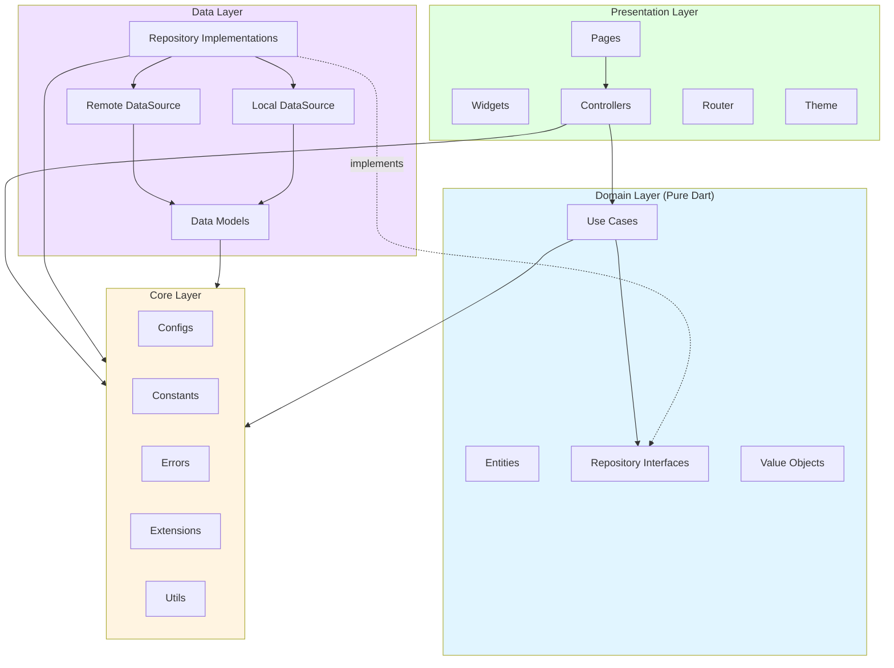
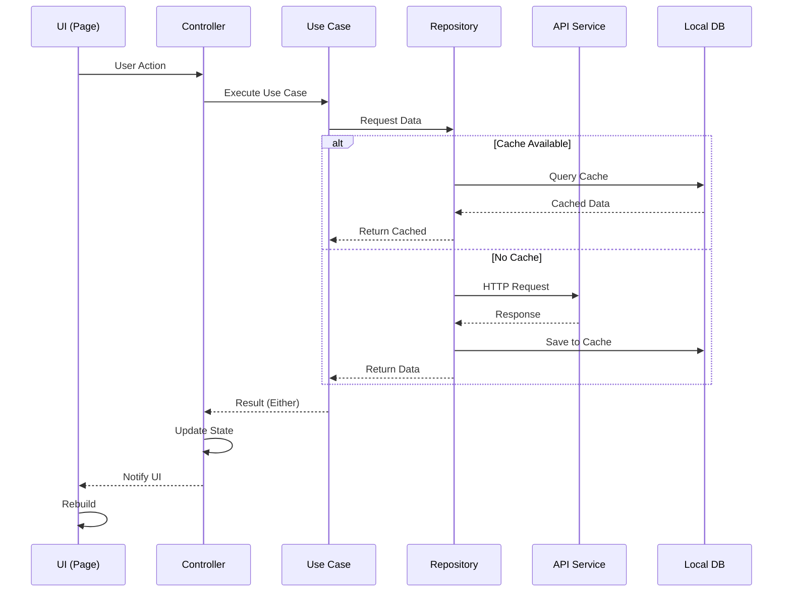
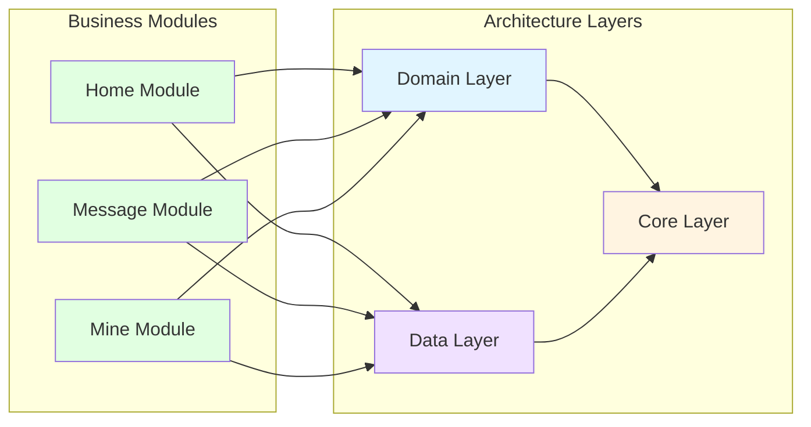
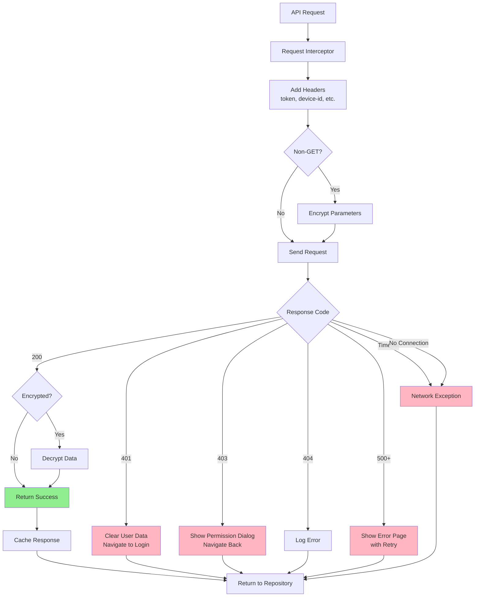

# Enterprise Flutter Framework

An enterprise-grade Flutter application framework based on Flutter 3.24.0, integrating DDD (Domain-Driven Design) and Clean Architecture principles. This framework is designed to support large-scale commercial applications with millions of users, providing high scalability, robustness, and performance.

## 📖 Introduction

This framework provides a complete foundation for building enterprise Flutter applications with:

- **Clean Architecture**: Four-layer architecture with strict dependency inversion
- **Type Safety**: 100% type-safe routing, API calls, and state management
- **Performance**: Optimized for large-scale applications with advanced caching and lazy loading
- **Multi-Environment**: Built-in support for dev/test/prod environments
- **Comprehensive Testing**: Dual testing approach with unit tests and property-based tests
- **Production Ready**: Includes logging, crash reporting, analytics, and monitoring

### Key Features

- ✅ **State Management**: GetX + Flutter Hooks for reactive state management
- ✅ **Networking**: Dio + Retrofit with automatic encryption, retry, and caching
- ✅ **Local Storage**: Isar database + SharedPreferences for high-performance data persistence
- ✅ **Routing**: AutoRoute for type-safe navigation with deep linking support
- ✅ **Theme System**: Dynamic theme switching with light/dark/custom modes
- ✅ **Internationalization**: Multi-language support with EasyLocalization
- ✅ **Error Handling**: Comprehensive exception hierarchy with automatic error reporting
- ✅ **Analytics**: Firebase Analytics integration with automatic page tracking
- ✅ **Offline Support**: Automatic request caching and retry when network reconnects
- ✅ **Code Generation**: Freezed, json_serializable, Retrofit, AutoRoute, Isar

## 🏗️ Architecture

This project follows a strict four-layer Clean Architecture with Dependency Inversion Principle:

### Architecture Philosophy

The framework enforces **Dependency Inversion**: upper layers depend on lower layer interfaces, not concrete implementations. This ensures:

- **Testability**: Each layer can be tested independently
- **Maintainability**: Changes in one layer don't affect others
- **Scalability**: Easy to add new features without breaking existing code
- **Flexibility**: Easy to swap implementations (e.g., change database or API client)

### Four Layers

```
┌─────────────────────────────────────────────────────────────┐
│              Presentation Layer (UI)                        │
│  - Pages: UI screens and layouts                            │
│  - Widgets: Reusable UI components                          │
│  - Controllers: State management with GetX                  │
│  - Navigation: Type-safe routing with AutoRoute             │
│  - Theme: Dynamic theme system                              │
├─────────────────────────────────────────────────────────────┤
│              Domain Layer (Pure Business Logic)             │
│  - Entities: Core business models (immutable with Freezed)  │
│  - Use Cases: Single-responsibility business operations     │
│  - Repository Interfaces: Abstract data access contracts    │
│  - Value Objects: Domain primitives with validation         │
│  ⚠️  Pure Dart only - NO Flutter or external dependencies   │
├─────────────────────────────────────────────────────────────┤
│              Data Layer (Data Sources)                      │
│  - Repository Implementations: Concrete data access         │
│  - Remote DataSource: API calls with Dio + Retrofit         │
│  - Local DataSource: Isar database + SharedPreferences      │
│  - Data Models: Request/Response DTOs with serialization    │
│  - Interceptors: Request/response processing                │
├─────────────────────────────────────────────────────────────┤
│              Core Layer (Infrastructure)                    │
│  - Configs: App and environment configurations              │
│  - Constants: App-wide constants (routes, errors, keys)     │
│  - Errors: Exception hierarchy                              │
│  - Extensions: Dart and Flutter extensions                  │
│  - Utils: Utility classes (encryption, validation, format)  │
└─────────────────────────────────────────────────────────────┘
```

### Architecture Diagram

#### Layer Dependencies



#### Data Flow



#### Module Dependencies



#### Network Request Flow



#### State Management Flow

```mermaid
graph TB
    UserAction[User Action] --> Controller[Controller]
    Controller --> UseCase[Use Case]
    UseCase --> Repository[Repository]
    
    Repository --> Remote{Data Source}
    Remote -->|API| APICall[API Call]
    Remote -->|Cache| DBQuery[DB Query]
    
    APICall --> Result{Result}
    DBQuery --> Result
    
    Result -->|Success| UpdateState[Update State]
    Result -->|Error| HandleError[Handle Error]
    
    UpdateState --> NotifyUI[Notify UI<br/>update()]
    HandleError --> NotifyUI
    
    NotifyUI --> Rebuild[UI Rebuild]
    
    style UserAction fill:#E1FFE1
    style Controller fill:#E1FFE1
    style UpdateState fill:#90EE90
    style HandleError fill:#FFB6C1
    style Rebuild fill:#E1FFE1
```

## 🚀 Tech Stack

### Core Framework

| Category | Technology | Version | Purpose |
|----------|-----------|---------|---------|
| Framework | Flutter | 3.24.0+ | Cross-platform UI framework |
| Language | Dart | 3.0.0+ | Programming language |

### State Management

| Technology | Version | Purpose |
|-----------|---------|---------|
| GetX | 4.6.6+ | Global and page-level reactive state management |
| Flutter Hooks | 0.20.5+ | Lightweight component-level state management |
| Freezed | 2.4.6+ | Immutable data classes with code generation |

### Networking

| Technology | Version | Purpose |
|-----------|---------|---------|
| Dio | 5.4.0+ | HTTP client with interceptors |
| Retrofit | 4.0.3+ | Type-safe REST API client generation |
| json_serializable | 6.7.1+ | JSON serialization code generation |

### Local Storage

| Technology | Version | Purpose |
|-----------|---------|---------|
| Isar | 3.1.0+ | High-performance NoSQL database |
| SharedPreferences | 2.2.2+ | Key-value storage for lightweight configs |

### Routing & Navigation

| Technology | Version | Purpose |
|-----------|---------|---------|
| AutoRoute | 7.8.4+ | Type-safe routing with code generation |

### Dependency Injection

| Technology | Version | Purpose |
|-----------|---------|---------|
| GetIt | 7.6.4+ | Service locator for dependency injection |

### Internationalization

| Technology | Version | Purpose |
|-----------|---------|---------|
| EasyLocalization | 3.0.3+ | Multi-language support with JSON translations |

### Utilities

| Technology | Version | Purpose |
|-----------|---------|---------|
| Logger | 2.0.2+ | Structured logging with multiple levels |
| encrypt | 5.0.3+ | AES encryption for sensitive data |
| connectivity_plus | 5.0.2+ | Network connectivity monitoring |
| device_info_plus | 9.1.1+ | Device information retrieval |

### Firebase Integration

| Technology | Version | Purpose |
|-----------|---------|---------|
| Firebase Core | 2.24.2+ | Firebase SDK initialization |
| Firebase Analytics | 10.8.0+ | User behavior tracking and analytics |
| Firebase Crashlytics | 3.4.9+ | Crash reporting and monitoring |

### Code Quality

| Technology | Version | Purpose |
|-----------|---------|---------|
| flutter_lints | 3.0.1+ | Official Flutter linting rules |
| build_runner | 2.4.7+ | Code generation runner |

## 📁 Project Structure

The project follows a modular structure organized by architectural layers:

```
lib/
├── core/                           # Core Layer - Infrastructure
│   ├── configs/                   # Configuration management
│   │   ├── app_config.dart       # App metadata and API configs
│   │   └── flavor_config.dart    # Multi-environment configuration
│   ├── constants/                 # App-wide constants
│   │   ├── app_constants.dart    # General constants
│   │   ├── cache_keys.dart       # Storage keys
│   │   ├── error_code.dart       # Error code definitions
│   │   └── route_names.dart      # Route name constants
│   ├── errors/                    # Exception hierarchy
│   │   ├── base_exception.dart   # Base exception class
│   │   ├── business_exception.dart
│   │   ├── network_exception.dart
│   │   └── system_exception.dart
│   ├── extensions/                # Dart & Flutter extensions
│   │   ├── dart_extensions.dart  # String, int, DateTime extensions
│   │   └── flutter_extensions.dart # BuildContext, Widget extensions
│   ├── services/                  # Core services
│   │   ├── analytics_manager.dart # Firebase Analytics wrapper
│   │   └── deep_link_service.dart # Deep linking handler
│   └── utils/                     # Utility classes
│       ├── encryption_util.dart  # AES encryption/decryption
│       ├── format_util.dart      # Data formatting
│       ├── log_util.dart         # Logging wrapper
│       └── validation_util.dart  # Input validation
│
├── domain/                         # Domain Layer - Pure Business Logic
│   ├── entities/                  # Business entities (Freezed)
│   │   ├── message_entity.dart
│   │   └── user_entity.dart
│   ├── repositories/              # Repository interfaces (contracts)
│   │   ├── message_repository.dart
│   │   └── user_repository.dart
│   ├── usecases/                  # Business use cases
│   │   ├── get_home_data_usecase.dart
│   │   ├── get_unread_message_usecase.dart
│   │   ├── get_user_info_usecase.dart
│   │   ├── logout_usecase.dart
│   │   └── mark_message_read_usecase.dart
│   └── value_objects/             # Domain primitives with validation
│       ├── email.dart
│       ├── phone_number.dart
│       └── user_id.dart
│
├── data/                           # Data Layer - Data Sources
│   ├── datasources/
│   │   ├── local/                 # Local data sources
│   │   │   ├── dao/              # Data Access Objects
│   │   │   │   ├── cached_request_isar_dao.dart
│   │   │   │   ├── message_isar_dao.dart
│   │   │   │   └── user_isar_dao.dart
│   │   │   ├── models/           # Isar models
│   │   │   │   ├── cached_request_isar_model.dart
│   │   │   │   ├── message_isar_model.dart
│   │   │   │   └── user_isar_model.dart
│   │   │   ├── isar_manager.dart # Isar database manager
│   │   │   └── sp_manager.dart   # SharedPreferences manager
│   │   └── remote/                # Remote data sources
│   │       ├── api/              # API service interfaces (Retrofit)
│   │       │   ├── message_api_service.dart
│   │       │   └── user_api_service.dart
│   │       ├── interceptors/     # Dio interceptors
│   │       │   ├── error_interceptor.dart
│   │       │   ├── request_interceptor.dart
│   │       │   └── response_interceptor.dart
│   │       ├── services/         # Additional services
│   │       │   └── request_cache_service.dart
│   │       └── api_client.dart   # Dio configuration
│   ├── models/                    # Data Transfer Objects
│   │   ├── base_response.dart    # Generic API response wrapper
│   │   ├── message_response.dart
│   │   └── user_response.dart
│   └── repositories/              # Repository implementations
│       ├── message_repository_impl.dart
│       └── user_repository_impl.dart
│
├── presentation/                   # Presentation Layer - UI
│   ├── controllers/               # State controllers (GetX)
│   │   ├── base_controller.dart  # Base controller with common logic
│   │   ├── home_controller.dart
│   │   ├── main_tab_controller.dart
│   │   ├── message_controller.dart
│   │   ├── mine_controller.dart
│   │   └── network_controller.dart
│   ├── navigation/                # Routing configuration
│   │   ├── app_router.dart       # AutoRoute configuration
│   │   └── auth_guard.dart       # Route guards
│   ├── pages/                     # Page widgets
│   │   ├── base_page.dart        # Base page with common UI
│   │   ├── home/                 # Home module
│   │   │   ├── home_page.dart
│   │   │   └── widgets/
│   │   ├── message/              # Message module
│   │   │   ├── message_page.dart
│   │   │   ├── message_detail_page.dart
│   │   │   └── widgets/
│   │   ├── mine/                 # Mine (profile) module
│   │   │   ├── mine_page.dart
│   │   │   ├── setting_page.dart
│   │   │   ├── theme_setting_page.dart
│   │   │   ├── language_setting_page.dart
│   │   │   └── widgets/
│   │   └── main_tab_page.dart    # Bottom tab navigation
│   ├── theme/                     # Theme system
│   │   ├── app_theme.dart        # Theme definitions
│   │   └── theme_controller.dart # Theme state management
│   └── widgets/                   # Reusable widgets
│       ├── empty_widget.dart     # Empty state widget
│       ├── loading_widget.dart   # Loading indicator
│       ├── optimized_image.dart  # Optimized image loading
│       ├── refresh_load_more_list.dart # Pull-to-refresh list
│       ├── skeleton_widget.dart  # Skeleton loading
│       └── theme/
│           └── theme_switcher_widget.dart
│
├── injection/                      # Dependency Injection
│   └── locator.dart               # GetIt service locator setup
│
├── firebase_options.dart          # Firebase configuration
├── main.dart                      # Main entry (placeholder)
├── main_dev.dart                  # Development entry point
├── main_test.dart                 # Test entry point
└── main_prod.dart                 # Production entry point

test/                               # Test files (mirrors lib/ structure)
├── core/
├── data/
├── domain/
└── presentation/

assets/                             # Static assets
├── images/                        # Image assets
└── translations/                  # i18n JSON files
    ├── en.json                    # English translations
    └── zh.json                    # Chinese translations
```

### Module Organization

The framework is organized into three business modules:

1. **Home Module** (`presentation/pages/home/`)
   - Banner carousel display
   - Content list with pagination
   - Pull-to-refresh and load more

2. **Message Module** (`presentation/pages/message/`)
   - Message list with unread indicators
   - Message detail view
   - Mark as read functionality
   - Unread count badge

3. **Mine Module** (`presentation/pages/mine/`)
   - User profile display
   - Settings (theme, language)
   - Logout functionality

## 🛠️ Setup Guide

### Prerequisites

Before you begin, ensure you have the following installed:

- **Flutter SDK**: 3.24.0 or higher
  - Download from: https://docs.flutter.dev/get-started/install
  - Verify: `flutter --version`
  
- **Dart SDK**: 3.0.0 or higher (included with Flutter)
  - Verify: `dart --version`
  
- **IDE**: Choose one
  - Android Studio with Flutter plugin
  - VS Code with Flutter extension
  - IntelliJ IDEA with Flutter plugin
  
- **Platform-Specific Tools**:
  - **For Android**: Android Studio, Android SDK, Java JDK 11+
  - **For iOS**: Xcode 15+, CocoaPods (macOS only)
  
- **Additional Tools**:
  - Git for version control
  - FVM (Flutter Version Management) - recommended for version consistency

### Development Environment Setup

#### 1. Install Flutter with FVM (Recommended)

FVM ensures all team members use the same Flutter version:

```bash
# Install FVM
dart pub global activate fvm

# Install Flutter 3.24.0 (or the version specified in .fvmrc)
fvm install 3.24.0

# Use the installed version
fvm use 3.24.0

# Verify installation
fvm flutter --version
```

See [FVM_SETUP_GUIDE.md](FVM_SETUP_GUIDE.md) for detailed instructions.

#### 2. Clone the Repository

```bash
git clone <repository-url>
cd enterprise_flutter_app
```

#### 3. Install Dependencies

```bash
# If using FVM
fvm flutter pub get

# If using system Flutter
flutter pub get
```

#### 4. Generate Code

The project uses code generation for Freezed, json_serializable, Retrofit, AutoRoute, and Isar:

```bash
# One-time generation
flutter pub run build_runner build --delete-conflicting-outputs

# Watch mode (auto-regenerate on file changes) - recommended during development
flutter pub run build_runner watch --delete-conflicting-outputs
```

#### 5. Configure Firebase (Optional but Recommended)

For analytics and crash reporting:

1. Create Firebase projects for each environment (dev, test, prod)
2. Download configuration files:
   - Android: `google-services.json` → `android/app/src/{flavor}/`
   - iOS: `GoogleService-Info.plist` → `ios/Runner/{Flavor}/`
3. Run Firebase configuration:
   ```bash
   flutterfire configure
   ```

See [FIREBASE_SETUP_GUIDE.md](FIREBASE_SETUP_GUIDE.md) for detailed instructions.

### Flavor Configuration

The app supports three environments (flavors):

#### Development (dev)
- **Purpose**: Local development and testing
- **API**: Development server
- **Logging**: Verbose debug logs enabled
- **Crashlytics**: Disabled

#### Test (test)
- **Purpose**: QA testing and staging
- **API**: Test/staging server
- **Logging**: Debug logs enabled
- **Crashlytics**: Enabled

#### Production (prod)
- **Purpose**: Production release
- **API**: Production server
- **Logging**: Error logs only
- **Crashlytics**: Enabled
- **Code Obfuscation**: Enabled

#### Configuring Flavors

**Android Configuration:**

Flavors are configured in `android/app/build.gradle.kts`:

```kotlin
flavorDimensions += "environment"
productFlavors {
    create("dev") {
        dimension = "environment"
        applicationIdSuffix = ".dev"
        versionNameSuffix = "-dev"
        resValue("string", "app_name", "Enterprise App (Dev)")
    }
    create("test") {
        dimension = "environment"
        applicationIdSuffix = ".test"
        versionNameSuffix = "-test"
        resValue("string", "app_name", "Enterprise App (Test)")
    }
    create("prod") {
        dimension = "environment"
        resValue("string", "app_name", "Enterprise App")
    }
}
```

See [android/FLAVOR_CONFIGURATION.md](android/FLAVOR_CONFIGURATION.md) for details.

**iOS Configuration:**

Flavors are configured as Xcode schemes with separate configurations:

- Dev scheme → Dev.xcconfig
- Test scheme → Test.xcconfig
- Prod scheme → Prod.xcconfig

See [ios/FLAVOR_CONFIGURATION.md](ios/FLAVOR_CONFIGURATION.md) for details.

### Dependency Installation

#### Core Dependencies

All dependencies are managed in `pubspec.yaml`. Key dependencies include:

**State Management:**
```yaml
get: ^4.6.6
flutter_hooks: ^0.20.5
freezed: ^2.4.6
freezed_annotation: ^2.4.1
```

**Networking:**
```yaml
dio: ^5.4.0
retrofit: ^4.0.3
json_annotation: ^4.8.1
```

**Storage:**
```yaml
isar: ^3.1.0+1
isar_flutter_libs: ^3.1.0+1
shared_preferences: ^2.2.2
```

**Routing:**
```yaml
auto_route: ^7.8.4
```

**Utilities:**
```yaml
logger: ^2.0.2+1
encrypt: ^5.0.3
connectivity_plus: ^5.0.2
device_info_plus: ^9.1.1
```

#### Dev Dependencies

```yaml
build_runner: ^2.4.7
freezed: ^2.4.6
json_serializable: ^6.7.1
retrofit_generator: ^8.0.6
auto_route_generator: ^7.3.2
isar_generator: ^3.1.0+1
flutter_lints: ^3.0.1
```

### Troubleshooting Setup Issues

**Issue**: Flutter version mismatch
```bash
# Solution: Use FVM to ensure correct version
fvm use 3.24.0
fvm flutter pub get
```

**Issue**: Code generation fails
```bash
# Solution: Clean and regenerate
flutter clean
flutter pub get
find . -name "*.g.dart" -delete
find . -name "*.freezed.dart" -delete
flutter pub run build_runner build --delete-conflicting-outputs
```

**Issue**: Isar schema errors
```bash
# Solution: Delete Isar files and regenerate
find . -name "*.isar" -delete
flutter pub run build_runner build --delete-conflicting-outputs
```

**Issue**: Android build fails
```bash
# Solution: Clean Android build
cd android
./gradlew clean
cd ..
flutter clean
flutter pub get
```

**Issue**: iOS build fails
```bash
# Solution: Clean iOS build and reinstall pods
cd ios
rm -rf Pods Podfile.lock
pod install
cd ..
flutter clean
flutter pub get
```

## 🏃 Running the App

### Quick Start

```bash
# Run in development mode (recommended for development)
flutter run -t lib/main_dev.dart

# Or with flavor (requires platform-specific setup)
flutter run --flavor dev -t lib/main_dev.dart
```

### Running Different Environments

#### Development Environment

```bash
# Run on connected device/emulator
flutter run -t lib/main_dev.dart

# Run with flavor
flutter run --flavor dev -t lib/main_dev.dart

# Run on specific device
flutter run -t lib/main_dev.dart -d <device-id>

# Run with hot reload enabled (default)
flutter run -t lib/main_dev.dart --hot
```

#### Test Environment

```bash
# Run test environment
flutter run -t lib/main_test.dart

# Run with flavor
flutter run --flavor test -t lib/main_test.dart
```

#### Production Environment

```bash
# Run in release mode (optimized)
flutter run -t lib/main_prod.dart --release

# Run with flavor
flutter run --flavor prod -t lib/main_prod.dart --release
```

### Build Commands

#### Android Builds

```bash
# Debug APK (development)
flutter build apk --flavor dev --debug -t lib/main_dev.dart

# Release APK (production)
flutter build apk --flavor prod --release -t lib/main_prod.dart

# Release APK with obfuscation (recommended for production)
flutter build apk --flavor prod --release --obfuscate --split-debug-info=build/app/outputs/symbols -t lib/main_prod.dart

# App Bundle for Google Play Store
flutter build appbundle --flavor prod --release --obfuscate --split-debug-info=build/app/outputs/symbols -t lib/main_prod.dart

# Split APKs by ABI (smaller file size)
flutter build apk --flavor prod --release --split-per-abi -t lib/main_prod.dart
```

#### iOS Builds

```bash
# Debug build
flutter build ios --flavor dev --debug -t lib/main_dev.dart

# Release build
flutter build ios --flavor prod --release -t lib/main_prod.dart

# Release build with obfuscation
flutter build ios --flavor prod --release --obfuscate --split-debug-info=build/ios/symbols -t lib/main_prod.dart

# Build IPA for distribution
flutter build ipa --flavor prod --release --obfuscate --split-debug-info=build/ios/symbols -t lib/main_prod.dart
```

## 💡 Usage Examples

### Core Capabilities

#### 1. Network Requests

**Making API Calls:**

```dart
// In a repository implementation
class UserRepositoryImpl implements UserRepository {
  final UserApiService _apiService;
  
  @override
  Future<Either<BaseException, UserEntity>> getUserInfo(String userId) async {
    try {
      final response = await _apiService.getUserInfo(userId);
      return Right(response.data!.toEntity());
    } on DioException catch (e) {
      return Left(e.error as BaseException);
    }
  }
}
```

**Defining API Endpoints (Retrofit):**

```dart
@RestApi()
abstract class UserApiService {
  factory UserApiService(Dio dio) = _UserApiService;
  
  @GET('/user/{id}')
  Future<BaseResponse<UserResponse>> getUserInfo(@Path('id') String userId);
  
  @POST('/user')
  Future<BaseResponse<UserResponse>> createUser(@Body() Map<String, dynamic> data);
}
```

#### 2. State Management

**Using GetX Controller:**

```dart
class HomeController extends BaseController {
  final GetHomeDataUseCase _getHomeDataUseCase;
  
  final banners = <BannerEntity>[].obs;
  final listItems = <ItemEntity>[].obs;
  
  @override
  void onInit() {
    super.onInit();
    loadData();
  }
  
  Future<void> loadData() async {
    setState(UIState.loading);
    
    final result = await _getHomeDataUseCase();
    
    result.fold(
      (error) => setState(UIState.error),
      (data) {
        banners.value = data.banners;
        listItems.value = data.items;
        setState(UIState.success);
      },
    );
  }
}
```

**Using Flutter Hooks:**

```dart
class MyWidget extends HookWidget {
  @override
  Widget build(BuildContext context) {
    final count = useState(0);
    final controller = useTextEditingController();
    
    useEffect(() {
      // Runs on mount
      print('Widget mounted');
      return () {
        // Cleanup on unmount
        print('Widget unmounted');
      };
    }, []);
    
    return Column(
      children: [
        Text('Count: ${count.value}'),
        ElevatedButton(
          onPressed: () => count.value++,
          child: Text('Increment'),
        ),
      ],
    );
  }
}
```

#### 3. Routing & Navigation

**Defining Routes:**

```dart
@MaterialAutoRouter(
  routes: <AutoRoute>[
    AutoRoute(page: MainTabPage, initial: true),
    AutoRoute(page: HomePage, path: '/home'),
    AutoRoute(page: MessagePage, path: '/message'),
    AutoRoute(page: MessageDetailPage, path: '/message/:id'),
    AutoRoute(page: MinePage, path: '/mine', guards: [AuthGuard]),
  ],
)
class $AppRouter {}
```

**Navigating:**

```dart
// Navigate to a page
context.router.push(MessageDetailRoute(messageId: '123'));

// Navigate and replace
context.router.replace(HomeRoute());

// Navigate back
context.router.pop();

// Navigate with result
final result = await context.router.push(SettingRoute());
```

#### 4. Theme Switching

**Changing Theme:**

```dart
// In ThemeController
void setThemeMode(AppThemeMode mode) {
  themeMode.value = mode;
  SPManager.saveThemeMode(mode.name);
  Get.changeThemeMode(_getThemeMode(mode));
}

// Usage in UI
final themeController = Get.find<ThemeController>();
themeController.setThemeMode(AppThemeMode.dark);
```

#### 5. Internationalization

**Changing Language:**

```dart
// Change language
await context.setLocale(Locale('zh'));

// Get translated text
Text('home.title'.tr())

// With parameters
Text('home.welcome'.tr(args: ['John']))
```

**Translation Files (assets/translations/en.json):**

```json
{
  "home": {
    "title": "Home",
    "welcome": "Welcome, {0}!"
  },
  "message": {
    "title": "Messages",
    "unread": "Unread: {0}"
  }
}
```

#### 6. Local Storage

**Using Isar:**

```dart
// Save data
await _isar.writeTxn(() async {
  await _isar.userIsarModels.put(userModel);
});

// Query data
final user = await _isar.userIsarModels
    .filter()
    .userIdEqualTo(userId)
    .findFirst();

// Delete data
await _isar.writeTxn(() async {
  await _isar.userIsarModels.delete(id);
});
```

**Using SharedPreferences:**

```dart
// Save
await SPManager.saveToken('your-token');

// Get
final token = await SPManager.getToken();

// Remove
await SPManager.removeToken();
```

#### 7. Error Handling

**Handling Errors:**

```dart
final result = await _repository.getUserInfo(userId);

result.fold(
  (error) {
    if (error is NetworkException) {
      // Handle network error
      showSnackbar('Network error: ${error.message}');
    } else if (error is BusinessException) {
      // Handle business logic error
      showDialog(error.message);
    }
  },
  (user) {
    // Handle success
    updateUI(user);
  },
);
```

#### 8. Logging

**Using LogUtil:**

```dart
// Debug log (only in dev)
LogUtil.d('Debug message');

// Info log
LogUtil.i('Info message');

// Warning log
LogUtil.w('Warning message');

// Error log (reported to Crashlytics in prod)
LogUtil.e('Error message', error, stackTrace);
```

#### 9. Analytics

**Tracking Events:**

```dart
// Track page view (automatic in BasePage)
AnalyticsManager.logPageView('home_page');

// Track custom event
AnalyticsManager.logEvent(
  'button_click',
  parameters: {
    'button_name': 'submit',
    'screen': 'home',
  },
);
```

## 📝 Code Conventions

### Naming Conventions

#### Classes
- **PascalCase** for class names
- Examples: `UserRepository`, `HomePage`, `MessageEntity`

```dart
class UserRepository {}
class HomePage extends StatelessWidget {}
```

#### Methods and Variables
- **camelCase** for methods and variables
- Examples: `getUserInfo`, `isLoading`, `messageList`

```dart
Future<void> getUserInfo() async {}
bool isLoading = false;
List<Message> messageList = [];
```

#### Constants
- **UPPER_SNAKE_CASE** for constants
- Examples: `API_BASE_URL`, `MAX_RETRY_COUNT`, `DEFAULT_TIMEOUT`

```dart
class AppConstants {
  static const int MAX_RETRY_COUNT = 3;
  static const Duration DEFAULT_TIMEOUT = Duration(seconds: 30);
}
```

#### Files
- **snake_case** for file names
- Examples: `user_repository.dart`, `home_page.dart`, `message_entity.dart`

#### Routes
- **snake_case** with module prefix
- Examples: `home_index`, `message_detail`, `mine_setting`

```dart
class RouteNames {
  static const String HOME_INDEX = '/home';
  static const String MESSAGE_DETAIL = '/message/detail';
}
```

### Documentation

All public classes and methods must have documentation comments:

```dart
/// Repository for managing user data.
///
/// This repository handles user-related operations including
/// fetching user info, updating profile, and managing cache.
abstract class UserRepository {
  /// Fetches user information from the server.
  ///
  /// Returns [Right] with [UserEntity] on success,
  /// or [Left] with [BaseException] on failure.
  ///
  /// Example:
  /// ```dart
  /// final result = await repository.getUserInfo('user123');
  /// result.fold(
  ///   (error) => print('Error: $error'),
  ///   (user) => print('User: ${user.nickname}'),
  /// );
  /// ```
  Future<Either<BaseException, UserEntity>> getUserInfo(String userId);
}
```

### Code Quality Rules

1. **Null Safety**: Always use null-safe code
   - Avoid `!` operator unless absolutely necessary
   - Use `?.` for safe navigation
   - Use `??` for null coalescing

2. **Const Constructors**: Use `const` wherever possible
   ```dart
   const Text('Hello')  // Good
   Text('Hello')        // Avoid if possible
   ```

3. **Avoid Dynamic**: Specify types explicitly
   ```dart
   List<String> names = [];  // Good
   var names = [];           // Avoid
   ```

4. **No Print Statements**: Use LogUtil instead
   ```dart
   LogUtil.d('Debug message');  // Good
   print('Debug message');      // Bad
   ```

5. **Async/Await**: Prefer async/await over .then()
   ```dart
   // Good
   final result = await fetchData();
   
   // Avoid
   fetchData().then((result) => ...);
   ```

### Commit Message Conventions

Follow conventional commits format:

```
<type>(<scope>): <subject>

<body>

<footer>
```

**Types:**
- `feat`: New feature
- `fix`: Bug fix
- `docs`: Documentation changes
- `style`: Code style changes (formatting)
- `refactor`: Code refactoring
- `test`: Adding or updating tests
- `chore`: Maintenance tasks

**Examples:**
```
feat(auth): add biometric authentication

Implemented fingerprint and face ID authentication
for iOS and Android platforms.

Closes #123
```

```
fix(network): handle timeout errors correctly

Fixed issue where timeout errors were not being
caught properly in the error interceptor.
```

## 🧪 Testing

### Run all tests

```bash
flutter test
```

### Run tests with coverage

```bash
flutter test --coverage
```

### Generate coverage report

```bash
# Install lcov (macOS)
brew install lcov

# Generate HTML report
genhtml coverage/lcov.info -o coverage/html

# Open report
open coverage/html/index.html
```

## 📦 Building

### Android

```bash
# Debug APK
flutter build apk --flavor dev --debug

# Release APK
flutter build apk --flavor prod --release

# App Bundle (for Play Store)
flutter build appbundle --flavor prod --release
```

### iOS

```bash
# Debug
flutter build ios --flavor dev --debug

# Release
flutter build ios --flavor prod --release
```

## 🌍 Multi-Environment Configuration

The app supports three environments:

| Environment | API Base URL | Debug Logs | Crashlytics |
|-------------|--------------|------------|-------------|
| Development | https://dev-api.example.com | ✅ Enabled | ❌ Disabled |
| Test | https://test-api.example.com | ✅ Enabled | ✅ Enabled |
| Production | https://api.example.com | ❌ Disabled | ✅ Enabled |

Configuration is managed through `FlavorConfig` in `lib/core/configs/flavor_config.dart`.

## 📝 Code Conventions

### Naming Conventions

- **Classes**: PascalCase (e.g., `UserRepository`, `HomePage`)
- **Methods/Variables**: camelCase (e.g., `getUserInfo`, `isLoading`)
- **Constants**: UPPER_SNAKE_CASE (e.g., `API_BASE_URL`, `MAX_RETRY_COUNT`)
- **Files**: snake_case (e.g., `user_repository.dart`, `home_page.dart`)
- **Routes**: snake_case with module prefix (e.g., `home_index`, `message_detail`)

### Documentation

- All public classes and methods must have documentation comments (`///`)
- Use `@param` and `@return` tags for method documentation
- Include usage examples for complex APIs

### Code Quality

- Run `flutter analyze` before committing
- Fix all warnings and errors
- Follow the rules defined in `analysis_options.yaml`
- Use `const` constructors wherever possible
- Avoid using `print()` - use `LogUtil` instead

## 🔧 Code Generation

This project uses code generation for:

- **Freezed**: Immutable data classes
- **json_serializable**: JSON serialization
- **Retrofit**: API client generation
- **AutoRoute**: Route generation
- **Isar**: Database schema generation

Run code generation:

```bash
# Watch mode (auto-regenerate on file changes)
flutter pub run build_runner watch

# One-time generation
flutter pub run build_runner build --delete-conflicting-outputs
```

## 🐛 Troubleshooting

### Common Issues and Solutions

#### Build and Compilation Issues

**Issue 1: FlavorConfig has not been initialized**

```
Error: FlavorConfig._instance is null
```

**Solution:**
Make sure you're running a flavor-specific entry point, not `main.dart`:

```bash
# Correct
flutter run -t lib/main_dev.dart

# Incorrect
flutter run -t lib/main.dart
```

---

**Issue 2: Code generation fails**

```
Error: Could not find a file named "pubspec.yaml"
```

**Solution:**
Delete generated files and regenerate:

```bash
# Delete all generated files
find . -name "*.g.dart" -delete
find . -name "*.freezed.dart" -delete
find . -name "*.gr.dart" -delete

# Clean and regenerate
flutter clean
flutter pub get
flutter pub run build_runner build --delete-conflicting-outputs
```

---

**Issue 3: Isar schema version mismatch**

```
Error: Isar schema version mismatch
```

**Solution:**
Delete Isar database files and regenerate:

```bash
# Delete Isar files
find . -name "*.isar" -delete
find . -name "*.isar.lock" -delete

# Regenerate schema
flutter pub run build_runner build --delete-conflicting-outputs

# Reinstall app
flutter clean
flutter run -t lib/main_dev.dart
```

---

**Issue 4: Retrofit generation errors**

```
Error: The return type is neither 'Future<HttpResponse<T>>' nor 'Future<T>'
```

**Solution:**
Ensure your API service methods return the correct type:

```dart
// Correct
@GET('/user/{id}')
Future<BaseResponse<UserResponse>> getUserInfo(@Path('id') String userId);

// Incorrect
@GET('/user/{id}')
BaseResponse<UserResponse> getUserInfo(@Path('id') String userId);
```

Then regenerate:

```bash
flutter pub run build_runner build --delete-conflicting-outputs
```

---

#### Dependency Conflicts

**Issue 5: Version conflict errors**

```
Error: Because package_a depends on package_b ^1.0.0 and package_c depends on package_b ^2.0.0...
```

**Solution:**
1. Check `pubspec.yaml` for conflicting versions
2. Update dependencies to compatible versions
3. Use dependency overrides if necessary:

```yaml
dependency_overrides:
  package_b: ^2.0.0
```

4. Clean and reinstall:

```bash
flutter clean
rm pubspec.lock
flutter pub get
```

---

**Issue 6: Build runner conflicts**

```
Error: Conflicting outputs were detected
```

**Solution:**
Use the `--delete-conflicting-outputs` flag:

```bash
flutter pub run build_runner build --delete-conflicting-outputs
```

---

#### Platform-Specific Issues

**Issue 7: Android build fails with Gradle errors**

```
Error: Could not resolve all files for configuration ':app:debugRuntimeClasspath'
```

**Solution:**

```bash
# Clean Android build
cd android
./gradlew clean
./gradlew --stop
cd ..

# Clean Flutter
flutter clean
flutter pub get

# Rebuild
flutter build apk --flavor dev
```

---

**Issue 8: iOS build fails with CocoaPods errors**

```
Error: CocoaPods not installed or not in valid state
```

**Solution:**

```bash
# Update CocoaPods
sudo gem install cocoapods

# Clean and reinstall pods
cd ios
rm -rf Pods Podfile.lock
pod repo update
pod install
cd ..

# Clean Flutter
flutter clean
flutter pub get

# Rebuild
flutter build ios --flavor dev
```

---

**Issue 9: iOS signing errors**

```
Error: No signing certificate "iOS Development" found
```

**Solution:**
1. Open `ios/Runner.xcworkspace` in Xcode
2. Select Runner target
3. Go to Signing & Capabilities
4. Select your development team
5. Enable "Automatically manage signing"

---

#### Runtime Issues

**Issue 10: Network requests fail with SSL errors**

```
Error: HandshakeException: Handshake error in client
```

**Solution:**
For development only, you can bypass SSL verification (NOT for production):

```dart
// In ApiClient (dev only)
if (FlavorConfig.instance.flavor == Flavor.dev) {
  (_dio.httpClientAdapter as DefaultHttpClientAdapter).onHttpClientCreate = 
    (client) {
      client.badCertificateCallback = 
        (X509Certificate cert, String host, int port) => true;
      return client;
    };
}
```

For production, ensure your SSL certificates are valid.

---

**Issue 11: GetX controller not found**

```
Error: "HomeController" not found. You need to call "Get.put(HomeController())"
```

**Solution:**
Ensure the controller is registered before use:

```dart
// In page
class HomePage extends StatelessWidget {
  @override
  Widget build(BuildContext context) {
    // Register controller
    final controller = Get.put(HomeController());
    
    return Scaffold(...);
  }
}
```

Or use dependency injection:

```dart
// In locator.dart
getIt.registerFactory(() => HomeController(getIt()));

// In page
final controller = Get.put(getIt<HomeController>());
```

---

**Issue 12: Isar database locked**

```
Error: Isar instance is already open
```

**Solution:**
Ensure you're using the singleton pattern:

```dart
// Correct
final isar = await IsarManager.instance;

// Incorrect - opens multiple instances
final isar = await Isar.open([...]);
```

---

**Issue 13: Route not found**

```
Error: Could not find a route named "/home"
```

**Solution:**
1. Ensure route is defined in `app_router.dart`
2. Regenerate routes:

```bash
flutter pub run build_runner build --delete-conflicting-outputs
```

3. Use generated route classes:

```dart
// Correct
context.router.push(HomeRoute());

// Incorrect
context.router.pushNamed('/home');
```

---

#### Performance Issues

**Issue 14: App is slow or laggy**

**Solutions:**
1. Enable performance overlay to identify issues:

```bash
flutter run --profile -t lib/main_dev.dart
```

2. Check for:
   - Unnecessary rebuilds (use `const` constructors)
   - Large images (use `cached_network_image`)
   - Blocking operations on main thread (use `compute()`)
   - Memory leaks (dispose controllers properly)

3. Use DevTools for profiling:

```bash
flutter pub global activate devtools
flutter pub global run devtools
```

---

**Issue 15: Memory leaks**

**Solution:**
Ensure proper cleanup in controllers:

```dart
class MyController extends GetxController {
  late StreamSubscription _subscription;
  
  @override
  void onInit() {
    super.onInit();
    _subscription = stream.listen(...);
  }
  
  @override
  void onClose() {
    _subscription.cancel();  // Important!
    super.onClose();
  }
}
```

---

#### Testing Issues

**Issue 16: Tests fail with "Null check operator used on a null value"**

**Solution:**
Ensure test setup initializes all dependencies:

```dart
setUp(() {
  // Initialize GetIt
  getIt.registerSingleton<UserRepository>(MockUserRepository());
  
  // Initialize GetX
  Get.testMode = true;
});

tearDown(() {
  getIt.reset();
  Get.reset();
});
```

---

**Issue 17: Widget tests fail with "ServicesBinding.defaultBinaryMessenger was accessed before the binding was initialized"**

**Solution:**
Initialize test bindings:

```dart
testWidgets('test description', (WidgetTester tester) async {
  TestWidgetsFlutterBinding.ensureInitialized();
  
  await tester.pumpWidget(MyApp());
  // ... test code
});
```

---

### Debugging Tips

#### Enable Verbose Logging

```bash
# Run with verbose logging
flutter run -t lib/main_dev.dart -v

# Build with verbose logging
flutter build apk --flavor dev -v
```

#### Check Flutter Doctor

```bash
# Check for issues
flutter doctor -v

# Check for Android licenses
flutter doctor --android-licenses
```

#### Clear All Caches

```bash
# Nuclear option - clears everything
flutter clean
rm -rf build/
rm -rf .dart_tool/
rm pubspec.lock
rm -rf ios/Pods
rm ios/Podfile.lock
rm -rf android/.gradle
rm -rf android/build
rm -rf android/app/build

# Reinstall
flutter pub get
cd ios && pod install && cd ..
flutter pub run build_runner build --delete-conflicting-outputs
```

#### Analyze Code

```bash
# Run static analysis
flutter analyze

# Fix formatting issues
dart format lib/ test/

# Check for unused dependencies
flutter pub deps
```

### Getting Help

If you encounter issues not covered here:

1. **Check the logs**: Look for error messages in the console
2. **Search existing issues**: Check the project's issue tracker
3. **Ask the team**: Reach out on your team's communication channel
4. **Create an issue**: If it's a bug, create a detailed issue report with:
   - Flutter version (`flutter --version`)
   - Steps to reproduce
   - Expected vs actual behavior
   - Error logs and stack traces
   - Screenshots if applicable

### Useful Commands

```bash
# Check Flutter version
flutter --version

# Check connected devices
flutter devices

# Clean build artifacts
flutter clean

# Update dependencies
flutter pub upgrade

# Check for outdated packages
flutter pub outdated

# Run analyzer
flutter analyze

# Format code
dart format .

# Generate coverage report
flutter test --coverage
genhtml coverage/lcov.info -o coverage/html
```

## 📚 Additional Resources

### API Documentation

This project uses `dartdoc` to generate comprehensive API documentation for all public classes and methods.

#### Generating Documentation

```bash
# Generate API documentation
dart doc .

# Or with FVM
fvm dart doc .

# Documentation will be generated in doc/api/
```

**Note**: If you encounter path errors during documentation generation, ensure:
1. All imports in your code are correct
2. No circular dependencies exist
3. Run `flutter pub get` before generating docs
4. Try cleaning first: `flutter clean && flutter pub get`

If issues persist, you can generate documentation for specific packages:

```bash
# Generate docs for lib directory only
dart doc lib/

# Or use dartdoc directly with options
dart pub global activate dartdoc
dart pub global run dartdoc --output doc/api
```

#### Viewing Documentation

```bash
# Open in browser (macOS)
open doc/api/index.html

# Open in browser (Linux)
xdg-open doc/api/index.html

# Open in browser (Windows)
start doc/api/index.html
```

#### Documentation Guidelines

All public APIs must be documented with:

1. **Class Documentation**: Describe the purpose and usage
2. **Method Documentation**: Describe parameters, return values, and behavior
3. **Examples**: Provide usage examples for complex APIs
4. **See Also**: Link to related classes/methods

Example:

```dart
/// Repository for managing user data.
///
/// This repository handles user-related operations including
/// fetching user info, updating profile, and managing cache.
///
/// Example:
/// ```dart
/// final repository = UserRepositoryImpl(apiService, localDao);
/// final result = await repository.getUserInfo('user123');
/// ```
///
/// See also:
/// * [UserEntity] for the user data model
/// * [GetUserInfoUseCase] for the use case implementation
abstract class UserRepository {
  /// Fetches user information from the server.
  ///
  /// The [userId] parameter specifies which user to fetch.
  ///
  /// Returns [Right] with [UserEntity] on success,
  /// or [Left] with [BaseException] on failure.
  ///
  /// Throws:
  /// * [NetworkException] if network request fails
  /// * [BusinessException] if server returns an error
  Future<Either<BaseException, UserEntity>> getUserInfo(String userId);
}
```

### External Resources

- [Flutter Documentation](https://docs.flutter.dev/)
- [Dart Documentation](https://dart.dev/guides)
- [GetX Documentation](https://pub.dev/packages/get)
- [Freezed Documentation](https://pub.dev/packages/freezed)
- [Isar Documentation](https://isar.dev/)
- [AutoRoute Documentation](https://pub.dev/packages/auto_route)
- [Dio Documentation](https://pub.dev/packages/dio)
- [Retrofit Documentation](https://pub.dev/packages/retrofit)

### Project Documentation

- [FVM Setup Guide](FVM_SETUP_GUIDE.md) - Flutter Version Management setup
- [Firebase Setup Guide](FIREBASE_SETUP_GUIDE.md) - Firebase integration guide
- [Deep Linking Guide](DEEP_LINKING_GUIDE.md) - Deep linking configuration
- [Android Flavor Configuration](android/FLAVOR_CONFIGURATION.md) - Android flavor setup
- [iOS Flavor Configuration](ios/FLAVOR_CONFIGURATION.md) - iOS flavor setup
- [Data Layer Verification](DATA_LAYER_VERIFICATION.md) - Data layer checklist
- [Presentation Layer Verification](PRESENTATION_LAYER_VERIFICATION.md) - UI layer checklist

## 📄 License

This project is licensed under the MIT License - see the LICENSE file for details.

## 👥 Contributing

Contributions are welcome! Please follow these guidelines:

1. **Fork the repository** and create your branch from `main`
2. **Follow the code conventions** outlined in this README
3. **Write tests** for new features
4. **Update documentation** for API changes
5. **Run linter** before committing: `flutter analyze`
6. **Format code** before committing: `dart format .`
7. **Write clear commit messages** following conventional commits
8. **Submit a pull request** with a clear description

### Pull Request Process

1. Ensure all tests pass: `flutter test`
2. Update the README if needed
3. Update the CHANGELOG with your changes
4. Request review from maintainers
5. Address review feedback
6. Squash commits if requested

## 🔒 Security

### Sensitive Data

**IMPORTANT**: Never commit sensitive data to the repository:

- ❌ API keys and secrets
- ❌ Firebase configuration files (google-services.json, GoogleService-Info.plist)
- ❌ Encryption keys
- ❌ Database credentials
- ❌ Private certificates

### Environment Variables

Store sensitive configuration in environment-specific files that are gitignored:

```dart
// lib/core/configs/secrets.dart (gitignored)
class Secrets {
  static const String apiKey = 'your-api-key';
  static const String encryptionKey = 'your-encryption-key';
}
```

### Production Checklist

Before deploying to production:

- [ ] Update API base URLs to production endpoints
- [ ] Enable code obfuscation
- [ ] Disable debug logs
- [ ] Enable Crashlytics
- [ ] Test on real devices
- [ ] Verify SSL certificates
- [ ] Review permissions
- [ ] Test deep links
- [ ] Verify analytics tracking
- [ ] Test offline functionality
- [ ] Review security best practices

## 📊 Project Status

### Completed Features

- ✅ Four-layer Clean Architecture
- ✅ Multi-environment configuration (dev/test/prod)
- ✅ Type-safe networking with Dio + Retrofit
- ✅ High-performance local storage with Isar
- ✅ Type-safe routing with AutoRoute
- ✅ State management with GetX + Flutter Hooks
- ✅ Theme system with light/dark/custom modes
- ✅ Internationalization with EasyLocalization
- ✅ Firebase Analytics integration
- ✅ Firebase Crashlytics integration
- ✅ Deep linking support
- ✅ Offline request caching
- ✅ Network status monitoring
- ✅ Comprehensive error handling
- ✅ Logging system
- ✅ Code generation setup
- ✅ Testing infrastructure

### Business Modules

- ✅ Home Module (banner + list with pagination)
- ✅ Message Module (list + detail + unread badge)
- ✅ Mine Module (profile + settings)

## 🎯 Roadmap

Future enhancements:

- [ ] Biometric authentication
- [ ] Push notifications
- [ ] In-app updates
- [ ] A/B testing framework
- [ ] Performance monitoring
- [ ] Feature flags
- [ ] CI/CD pipeline
- [ ] Automated testing in CI
- [ ] App distribution automation

## 📞 Support

For questions or support:

- **Documentation**: Check this README and linked guides
- **Issues**: Create an issue in the repository
- **Team Chat**: Reach out on your team's communication channel

---

**Built with ❤️ using Flutter**

**Note**: This is an enterprise-grade framework. Make sure to:
- Update API URLs for your environment
- Configure Firebase with your projects
- Update encryption keys
- Review and customize theme colors
- Add your app icons and splash screens
- Update app name and package identifiers
- Configure signing certificates for release builds
